# Machine Learning Approach to Used Car Pricing Modeling
by Gene Ichinose
Nov 2022

## Business Understanding

The objective of this study is to determine what key factors drives the price of a used car. The business requirements are from the client who owns a used car dealership which requires information about what consumers value in a used car and information useful for pricing trade-ins as an alternative to kbb.com. The goal is to develop a set of factors that drive up or down a value of a car in dollar values and a model useful for predicting the price of a vehicle based on these factors.


The plan involves:

    1. Data understanding
        A. An exploration and inventory of the dataset 
        B. Identify which features are continuous and numerical versus which are discrete and categorical
        C. Identify the features and target for regression
    
    2. Data preparation
        A. Window the appropriate ranges of the features and targets
        B. Removal of the data with missing key features
        C. Removal of data outliers as a form of data quality control 
        D. Removal of duplicates 
        E. Logarithmic and exponential transformations of the target to achieve normal distributions
        F. Encoding categorical data (ordinal or one hot encoding).
        
    3. Modeling
        A. We will compare RIDGE and LASSO regression
        B. Set up a pipeline workflow to handle the transformations
        C. Set up a grid search to determine the best regularization hyperparameter alpha
        D. The regularization approach allows us to include many features without overfitting.
        E. Examination of the residuals over the target range
        F. Cross validation to check for overfitting
        
    4. Evaluation
        A. Analysis of Resulting Coefficients
        B. Importance of Coefficients
        C. Interpretation of Coefficients
        D. Implications to used car business
        E. Future directions
        
    5. Deployment
        A. Direct application: Comparison of the model to kbb.com with two example cars 

## Data understanding


```python
import pandas as pd
import numpy as np
import matplotlib.pyplot as plt
import seaborn as sns

import warnings
warnings.filterwarnings('ignore')
```


```python
#load the dataset
df = pd.read_csv('vehicles.csv')
```


```python
# drop columns that are too specific to each data point and would have little value in the regression
# also remove nan's
#
df.drop(columns=['id','VIN','region'], inplace=True)
df.dropna(inplace=True)
```


```python
df.info()
```

    <class 'pandas.core.frame.DataFrame'>
    Int64Index: 79195 entries, 31 to 426836
    Data columns (total 15 columns):
     #   Column        Non-Null Count  Dtype  
    ---  ------        --------------  -----  
     0   price         79195 non-null  int64  
     1   year          79195 non-null  float64
     2   manufacturer  79195 non-null  object 
     3   model         79195 non-null  object 
     4   condition     79195 non-null  object 
     5   cylinders     79195 non-null  object 
     6   fuel          79195 non-null  object 
     7   odometer      79195 non-null  float64
     8   title_status  79195 non-null  object 
     9   transmission  79195 non-null  object 
     10  drive         79195 non-null  object 
     11  size          79195 non-null  object 
     12  type          79195 non-null  object 
     13  paint_color   79195 non-null  object 
     14  state         79195 non-null  object 
    dtypes: float64(2), int64(1), object(12)
    memory usage: 9.7+ MB


```python
# Explore the range of unique values that are categorical
#
print(df['year'].sort_values().unique())
maker = df['manufacturer'].sort_values().unique()
print(f'number of manufacturers: {len(maker)}')
print(np.vstack(maker))

models = df['model'].unique()
print(f'number of models: {len(models)}')
print(models)

print(df['condition'].unique())
print(df['cylinders'].unique())
print(df['fuel'].unique())
print(df['title_status'].unique())
print(df['transmission'].unique())
print(df['drive'].unique())
print(df['size'].unique())
print(df['type'].unique())
print(df['paint_color'].unique())

states = df['state'].unique()
print(f'number of states: {len(states)}')
print(states)
```

    [1900. 1905. 1913. 1918. 1923. 1924. 1925. 1926. 1927. 1928. 1929. 1930.
     1931. 1932. 1933. 1934. 1935. 1936. 1937. 1938. 1939. 1940. 1941. 1942.
     1944. 1946. 1947. 1948. 1949. 1950. 1951. 1952. 1953. 1954. 1955. 1956.
     1957. 1958. 1959. 1960. 1961. 1962. 1963. 1964. 1965. 1966. 1967. 1968.
     1969. 1970. 1971. 1972. 1973. 1974. 1975. 1976. 1977. 1978. 1979. 1980.
     1981. 1982. 1983. 1984. 1985. 1986. 1987. 1988. 1989. 1990. 1991. 1992.
     1993. 1994. 1995. 1996. 1997. 1998. 1999. 2000. 2001. 2002. 2003. 2004.
     2005. 2006. 2007. 2008. 2009. 2010. 2011. 2012. 2013. 2014. 2015. 2016.
     2017. 2018. 2019. 2020. 2021. 2022.]
    number of manufacturers: 41
    [['acura']
     ['alfa-romeo']
     ['aston-martin']
     ['audi']
     ['bmw']
     ['buick']
     ['cadillac']
     ['chevrolet']
     ['chrysler']
     ['datsun']
     ['dodge']
     ['ferrari']
     ['fiat']
     ['ford']
     ['gmc']
     ['harley-davidson']
     ['honda']
     ['hyundai']
     ['infiniti']
     ['jaguar']
     ['jeep']
     ['kia']
     ['land rover']
     ['lexus']
     ['lincoln']
     ['mazda']
     ['mercedes-benz']
     ['mercury']
     ['mini']
     ['mitsubishi']
     ['nissan']
     ['pontiac']
     ['porsche']
     ['ram']
     ['rover']
     ['saturn']
     ['subaru']
     ['tesla']
     ['toyota']
     ['volkswagen']
     ['volvo']]
    number of models: 9529
    ['f-150 xlt' 'f250 super duty' 'odyssey' ... 'cj 3a willys'
     'rx& gls sport' 'gand wagoneer']
    ['excellent' 'good' 'like new' 'new' 'fair' 'salvage']
    ['6 cylinders' '8 cylinders' '4 cylinders' '5 cylinders' '10 cylinders'
     '3 cylinders' 'other' '12 cylinders']
    ['gas' 'diesel' 'hybrid' 'electric' 'other']
    ['clean' 'rebuilt' 'salvage' 'lien' 'missing' 'parts only']
    ['automatic' 'manual' 'other']
    ['rwd' '4wd' 'fwd']
    ['full-size' 'mid-size' 'compact' 'sub-compact']
    ['truck' 'pickup' 'mini-van' 'sedan' 'offroad' 'van' 'SUV' 'convertible'
     'coupe' 'hatchback' 'wagon' 'other' 'bus']
    ['black' 'blue' 'silver' 'white' 'grey' 'yellow' 'red' 'green' 'brown'
     'custom' 'purple' 'orange']
    number of states: 51
    ['al' 'ak' 'az' 'ar' 'ca' 'co' 'ct' 'dc' 'de' 'fl' 'ga' 'hi' 'id' 'il'
     'in' 'ia' 'ks' 'ky' 'la' 'me' 'md' 'ma' 'mi' 'mn' 'ms' 'mo' 'mt' 'nc'
     'ne' 'nv' 'nj' 'nm' 'ny' 'nh' 'nd' 'oh' 'ok' 'or' 'pa' 'ri' 'sc' 'sd'
     'tn' 'tx' 'ut' 'vt' 'va' 'wa' 'wv' 'wi' 'wy']


```python
df[['price', 'year', 'odometer']].corr()
```


<div>
<style scoped>
    .dataframe tbody tr th:only-of-type {
        vertical-align: middle;
    }

    .dataframe tbody tr th {
        vertical-align: top;
    }

    .dataframe thead th {
        text-align: right;
    }
</style>
<table border="1" class="dataframe">
  <thead>
    <tr style="text-align: right;">
      <th></th>
      <th>price</th>
      <th>year</th>
      <th>odometer</th>
    </tr>
  </thead>
  <tbody>
    <tr>
      <th>price</th>
      <td>1.000000</td>
      <td>-0.001535</td>
      <td>0.000620</td>
    </tr>
    <tr>
      <th>year</th>
      <td>-0.001535</td>
      <td>1.000000</td>
      <td>-0.091326</td>
    </tr>
    <tr>
      <th>odometer</th>
      <td>0.000620</td>
      <td>-0.091326</td>
      <td>1.000000</td>
    </tr>
  </tbody>
</table>
</div>


Some observations from initially exploring the dataset, 

1. There are too many makes (41) and models (9529) of vehicles to incorporate them into the initial regression analysis. We will only focus on the physical characteritics of the vehicles.


2. The dataset includes vehicles from all 50 states and DC. 


In future analysis, it would be interesting to look at the residuals of this analysis as a function of make, model, and state or region to see if there are any trends that warrent further inclusion in a more detailed analysis.

3. All other categorical data (cylinders, fuel, title_status, transmission, drive, size, type) appear to have no natural ordering/ranking therefore best handled using one-hot-encoding.  The category (condition) may have rank and therefore we will take a deeper look later.


4. There appears to be vehicles dating back to 1900.  We will need to check odometer, year and determine how to handle special cases like antiques. These will need to be removed to focus on developing a mainstream commercial model for used cars.


5. Before data preparation (windowing), we observe no correlation between year or odometer with price.  See later recalculation or correlation results after windowing.

## Data Preparation

Based on the precursory examination of the data, we select cars that are within a reasonable range of years, odometer milage, and target price.  

1. Dealers are not going to expend resources (i.e., time, paperwork, evaluation, sales floor space) on vehicles that will only sell for less than \\$ 2000. 

2. Customers can purchase almost any new car greater than \\$ 50k. Above \\$ 50k may involve special antiques, or specialized modified vehicles that will require additional features not available in this dataset

3. Customers may not want to purchase cars with over 150000 mi. Many parts will be worn and need replacing. The same applies to years where most consumers will not want a car older than 15 years (as of 2022) as parts will be aged and need replacing. Also, cars with less than 1000 mi are considered new cars in this study and removed.  

4. Remove cases with title_status = "parts only" not going to be sold as used cars. Title status as salvaged and rebuilt are included. These may be vehicles coming in from disaster zones (floods, hailstorms, or hurricanes)

5. The category 'condition' has a natural ranking. 

6. We find that as cars age, they also increase in odometer milage. We therefore apply filter to remove outliers by year. These may be errors in recording price, gifts from relatives or friends, and edge cases like antiques or heavily modified specialized vehicles.

7. After windowing, we observe that newer cars have a ~0.5 moderate positive correlation with price while odometer has a ~0.5 moderate negative correlation. This is more logically expected compared to the initial correlation that indicated no correlation with prices. 

8. After a few regression runs we could not fit the price target for the higher price ranges. We find that the distribution of price is not normal.  There is not enough data at the low and high ends with most of the data in the mid-price range.  This is causing misfitting.  We decided to take the log10 of the price-target and that changes the distribution of the price-target. 

9. In addition to transforming the price using log10, we finally selected the following features: 
    ['year', 'condition', 'cylinders', 'fuel', 'odometer', 'title_status', 'transmission', 'drive', 'size', 'type']
    
    After our initial exploration and fine tuning of the business understanding, it is time to construct our final dataset prior to modeling. Here, we want to make sure to handle any integrity issues and cleaning, the engineering of new features, any transformations that we believe should happen (scaling, logarithms, normalization, etc.), and general preparation for modeling with sklearn.


```python
# window the data
#
df_clean = df.query(' \
    (2000 < price < 50000) & \
    ( 2007 < year < 2023 ) & \
    ( 1000 < odometer < 150000 ) & \
    title_status != "parts only" \
')
```


```python
# fix the categorical ranking for condition
#
print(df_clean['condition'].unique())
df_clean['condition'] = df_clean['condition'].astype('category')
df_clean['condition'] = df_clean['condition'].cat.set_categories(
    ['salvage', 'fair', 'good', 'excellent', 'like new', 'new'], ordered=True)
```

    ['excellent' 'good' 'like new' 'new' 'fair' 'salvage']


```python
# remove outliers using 5-95% window on price per year
#
df_filtered = pd.DataFrame(columns=df_clean.columns)
yrs_lst = df_clean['year'].sort_values().unique()

for y in yrs_lst:
    n = df_clean.query('year == @y')['price'].count()
    q_low = df_clean.query('year == @y')['price'].quantile(0.05)
    q_hi  = df_clean.query('year == @y')['price'].quantile(0.95)
    df_tmp = df_clean.query( 'year == @y & ( @q_low < price <= @q_hi )') 
    nf = df_tmp.price.count()
    df_filtered = pd.concat( [df_tmp, df_filtered], axis=0, ignore_index=True )
    print(f'count= {n} filtered= {nf} year={y} q_low={q_low} q_hi={q_hi}')
```

    count= 2553 filtered= 2292 year=2008.0 q_low=3500.0 q_hi=27990.0
    count= 1960 filtered= 1759 year=2009.0 q_low=3900.0 q_hi=23000.0
    count= 2456 filtered= 2212 year=2010.0 q_low=4495.0 q_hi=22990.0
    count= 3046 filtered= 2740 year=2011.0 q_low=4950.0 q_hi=27990.0
    count= 3600 filtered= 3228 year=2012.0 q_low=5000.0 q_hi=32902.499999999985
    count= 4330 filtered= 3891 year=2013.0 q_low=5900.0 q_hi=29995.0
    count= 4118 filtered= 3708 year=2014.0 q_low=6495.0 q_hi=34500.0
    count= 3947 filtered= 3548 year=2015.0 q_low=7000.0 q_hi=43000.0
    count= 3263 filtered= 2930 year=2016.0 q_low=8495.0 q_hi=41999.9
    count= 3033 filtered= 2731 year=2017.0 q_low=9780.0 q_hi=41860.0
    count= 2351 filtered= 2125 year=2018.0 q_low=10962.5 q_hi=45995.0
    count= 1428 filtered= 1286 year=2019.0 q_low=14635.0 q_hi=46999.0
    count= 655 filtered= 589 year=2020.0 q_low=16210.0 q_hi=46659.99999999999
    count= 56 filtered= 53 year=2021.0 q_low=23499.25 q_hi=49995.0


```python
## fix the price column back to float, somehow got converted to object
df_filtered['price'] = df_filtered['price'].astype(float)
```


```python
# df_filtered.info()
df_filtered.head()
```


<div>
<style scoped>
    .dataframe tbody tr th:only-of-type {
        vertical-align: middle;
    }

    .dataframe tbody tr th {
        vertical-align: top;
    }

    .dataframe thead th {
        text-align: right;
    }
</style>
<table border="1" class="dataframe">
  <thead>
    <tr style="text-align: right;">
      <th></th>
      <th>price</th>
      <th>year</th>
      <th>manufacturer</th>
      <th>model</th>
      <th>condition</th>
      <th>cylinders</th>
      <th>fuel</th>
      <th>odometer</th>
      <th>title_status</th>
      <th>transmission</th>
      <th>drive</th>
      <th>size</th>
      <th>type</th>
      <th>paint_color</th>
      <th>state</th>
    </tr>
  </thead>
  <tbody>
    <tr>
      <th>0</th>
      <td>40900.0</td>
      <td>2021.0</td>
      <td>toyota</td>
      <td>tacoma 4wd</td>
      <td>good</td>
      <td>6 cylinders</td>
      <td>gas</td>
      <td>1582.0</td>
      <td>clean</td>
      <td>automatic</td>
      <td>4wd</td>
      <td>full-size</td>
      <td>truck</td>
      <td>silver</td>
      <td>al</td>
    </tr>
    <tr>
      <th>1</th>
      <td>40900.0</td>
      <td>2021.0</td>
      <td>toyota</td>
      <td>tacoma 4wd</td>
      <td>good</td>
      <td>6 cylinders</td>
      <td>gas</td>
      <td>1582.0</td>
      <td>clean</td>
      <td>automatic</td>
      <td>4wd</td>
      <td>full-size</td>
      <td>truck</td>
      <td>silver</td>
      <td>al</td>
    </tr>
    <tr>
      <th>2</th>
      <td>40900.0</td>
      <td>2021.0</td>
      <td>toyota</td>
      <td>tacoma 4wd</td>
      <td>good</td>
      <td>6 cylinders</td>
      <td>gas</td>
      <td>1582.0</td>
      <td>clean</td>
      <td>automatic</td>
      <td>4wd</td>
      <td>full-size</td>
      <td>truck</td>
      <td>silver</td>
      <td>al</td>
    </tr>
    <tr>
      <th>3</th>
      <td>31500.0</td>
      <td>2021.0</td>
      <td>toyota</td>
      <td>rav4</td>
      <td>like new</td>
      <td>4 cylinders</td>
      <td>gas</td>
      <td>2500.0</td>
      <td>lien</td>
      <td>automatic</td>
      <td>4wd</td>
      <td>mid-size</td>
      <td>SUV</td>
      <td>silver</td>
      <td>ak</td>
    </tr>
    <tr>
      <th>4</th>
      <td>26971.0</td>
      <td>2021.0</td>
      <td>toyota</td>
      <td>camry se awd</td>
      <td>like new</td>
      <td>4 cylinders</td>
      <td>gas</td>
      <td>3047.0</td>
      <td>clean</td>
      <td>automatic</td>
      <td>4wd</td>
      <td>mid-size</td>
      <td>sedan</td>
      <td>red</td>
      <td>az</td>
    </tr>
  </tbody>
</table>
</div>


```python
# for some reason, we accidentally introduced 6830 duplicates in the filtering process
#  identified after post filtering quality inspection
#
df_filtered.duplicated().sum()
```


    6830


```python
# removed dups
#
df_filtered.drop_duplicates(inplace=True)
df_filtered.info()
```

    <class 'pandas.core.frame.DataFrame'>
    Int64Index: 26262 entries, 0 to 33091
    Data columns (total 15 columns):
     #   Column        Non-Null Count  Dtype   
    ---  ------        --------------  -----   
     0   price         26262 non-null  float64 
     1   year          26262 non-null  float64 
     2   manufacturer  26262 non-null  object  
     3   model         26262 non-null  object  
     4   condition     26262 non-null  category
     5   cylinders     26262 non-null  object  
     6   fuel          26262 non-null  object  
     7   odometer      26262 non-null  float64 
     8   title_status  26262 non-null  object  
     9   transmission  26262 non-null  object  
     10  drive         26262 non-null  object  
     11  size          26262 non-null  object  
     12  type          26262 non-null  object  
     13  paint_color   26262 non-null  object  
     14  state         26262 non-null  object  
    dtypes: category(1), float64(3), object(11)
    memory usage: 3.0+ MB


```python
### examine the numerical values for correlation between variables
###
g = sns.pairplot(df_filtered, hue='condition')
g.fig.suptitle('Used Car Dataset - Numerical values', y=1.05)
plt.show()
```


    
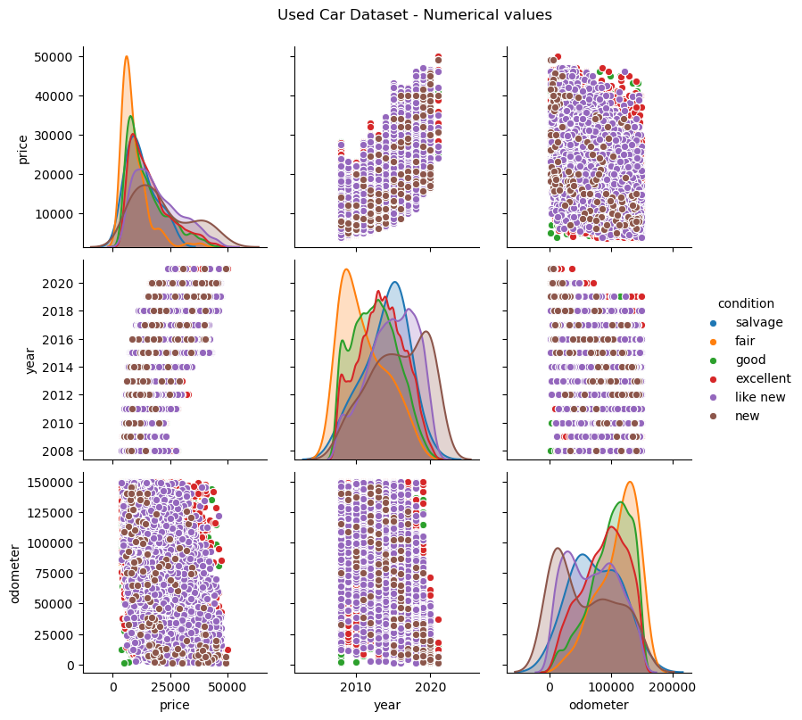
    


```python
### calculate correlation coeffients
###
df_filtered[['price', 'year', 'odometer']].corr()
```


<div>
<style scoped>
    .dataframe tbody tr th:only-of-type {
        vertical-align: middle;
    }

    .dataframe tbody tr th {
        vertical-align: top;
    }

    .dataframe thead th {
        text-align: right;
    }
</style>
<table border="1" class="dataframe">
  <thead>
    <tr style="text-align: right;">
      <th></th>
      <th>price</th>
      <th>year</th>
      <th>odometer</th>
    </tr>
  </thead>
  <tbody>
    <tr>
      <th>price</th>
      <td>1.000000</td>
      <td>0.627779</td>
      <td>-0.471256</td>
    </tr>
    <tr>
      <th>year</th>
      <td>0.627779</td>
      <td>1.000000</td>
      <td>-0.590513</td>
    </tr>
    <tr>
      <th>odometer</th>
      <td>-0.471256</td>
      <td>-0.590513</td>
      <td>1.000000</td>
    </tr>
  </tbody>
</table>
</div>


We now observe from the windowed and filtered dataset that used cars have a weak +0.6 positive correlation with price while odometer has a weak -0.5 negative correlation


```python
## make box plot to show behavior of car price by year 
##
sns.set(rc={'figure.figsize':(12,6)})
sns.boxplot(data=df_filtered, x='year', y='price').set(title='Distribution of price by year')
ax = plt.xticks(rotation=90)
plt.show()
```


    
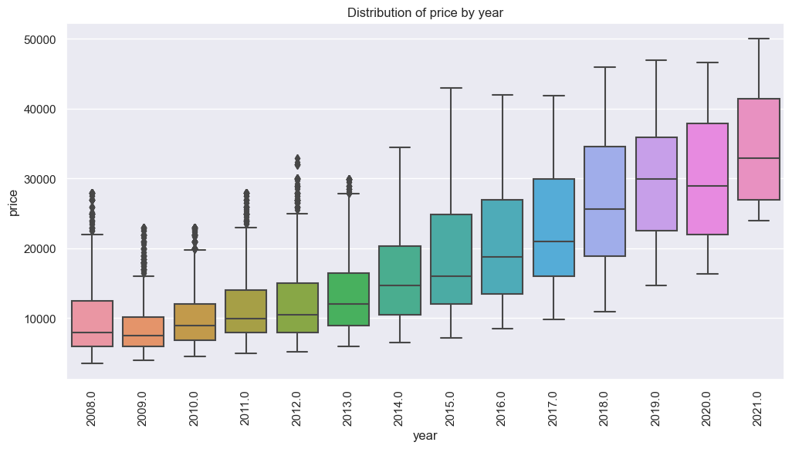
    


```python
## odometer mileage by year
##
sns.set(rc={'figure.figsize':(12,6)})
sns.boxplot(data=df_filtered, x='year', y='odometer').set(title='Distribution of odometer milage by year')
ax = plt.xticks(rotation=90)
plt.show()
```


    
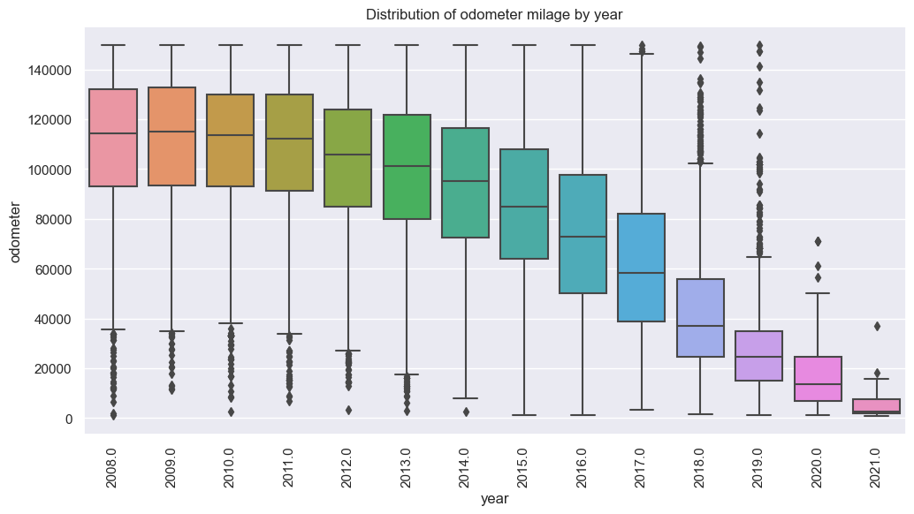
    


After windowing reasonable ranges and filtering outliers, the two box plots above show that price and odometer now have smooth trend with year. Price is increasing and odometer is inverse relation with time. This is logical expectation. Without data cleaning, these trends were difficult to see as shown with the changes in correlation. Note that the price of used cars flattens out below \\$ 10,000 after an age of 10 years (i.e., 2011 at the time of this report). At about this time, the odometer mileage also flattens out around 110,000 miles. 


```python
### Verify relation between price and condition category
###
sns.set(rc={'figure.figsize':(6,6)})
sns.boxplot(data=df_filtered, x='condition', y='price').set(title='Distribution of price by condition')
plt.show()
```


    
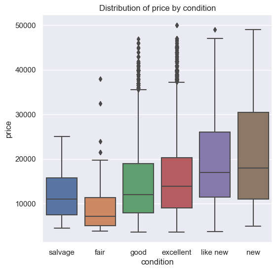
    


Above is the justification for ranking condition by price. Note the general trend between fair and new with price. The exception is with salvage which may include damaged cars in traffic accidents or cars damaged in natural disasters.  The severity of the damage may vary significantly and requires additional information to better resolve this category. 


```python
# compare original distribution of y-target price values with
#  log10(y-target) transformed values
#
fig, axs = plt.subplots(2, 1, figsize=(7,8))
fig.tight_layout(pad=5.0)

axs[0].hist( df_filtered['price'], bins=20)
axs[0].set_xlabel('Price ($)')
axs[0].set_ylabel('Counts')
axs[0].set_title('Original linear y-target distribution for regression')

axs[1].hist( np.log10(df_filtered['price']), bins=20)
axs[1].set_xlabel('Log10 Price ($)')
axs[1].set_ylabel('Counts')
axs[1].set_title('Log10 transformation of y-target distribution')
plt.show()
```


    
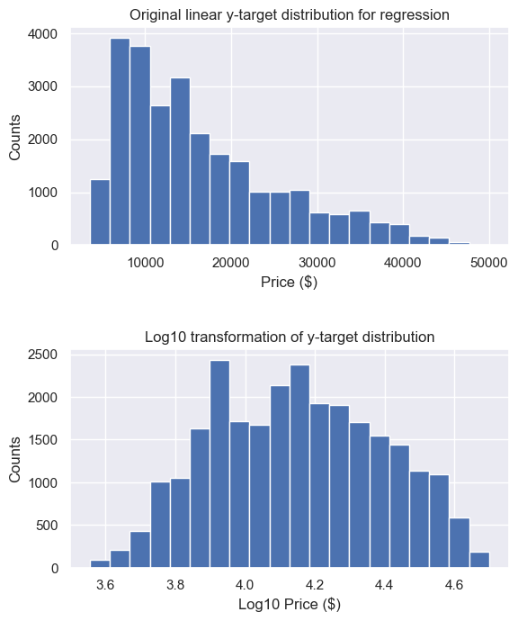
    


Above, log10 transform of the price-target is now more normal distribution.  


```python
# these are the final features selected for regression analysis
#
features = ['year', 'condition', 'cylinders', 'fuel', 'odometer', 
            'title_status', 'transmission', 'drive', 'size', 'type']
```


```python
# original runs using linear y-target did not fit data, tried taking log10(y)
# tested this using TransformTargetRegressor later
#
X = df_filtered[features]
#y = df_filtered['price']
y = np.log10( df_filtered['price'] )
# X.info()
# y.describe()
```

## Modeling

We first perform Ridge regression and compare results with LASSO regression method.  The MSE fits are similar between Ridge and LASSO, however, there are some differences in the coefficients. The misfit between observed and predicted price are improved with using the log10 transform on price.  The pipeline workflow allows for grid search for the hyperparameter alpha which controls the regularization. The low regularization (1.2 for Ridge and 1e-5 for LASSO) indicates that most of the coefficients are contributing to the model.  

We use 5-fold cross validation to check for over-fitting.  The MSE for each fold is close to the mean indicating that overfitting is controlled.  


```python
from sklearn.compose import make_column_transformer
from sklearn.linear_model import LinearRegression, Lasso, Ridge
from sklearn.pipeline import make_pipeline, Pipeline
from sklearn.model_selection import cross_val_score, cross_val_predict
from sklearn.model_selection import train_test_split, GridSearchCV
from sklearn.preprocessing import OneHotEncoder, OrdinalEncoder
from sklearn.preprocessing import StandardScaler, PolynomialFeatures
from sklearn.metrics import mean_squared_error
from sklearn.metrics import median_absolute_error
from sklearn.inspection import permutation_importance
from sklearn.feature_selection import SequentialFeatureSelector, SelectFromModel
from sklearn import set_config
set_config(display="diagram")

import warnings
warnings.filterwarnings('ignore')
```


```python
#### split dataset 70/30, hold-out 30% of dataset for subsequent testing
#
X_train, X_test, y_train, y_test = train_test_split(X, y, test_size=0.3, random_state=32)
print(X_train.shape)
print(X_test.shape)
```

    (18383, 10)
    (7879, 10)


```python
#### create column transformer for pipeline workflow
#
column_trans = make_column_transformer(
    (StandardScaler(), ['year', 'odometer']),
    (OneHotEncoder(handle_unknown='ignore'), ['cylinders', 'fuel', 'title_status', 'transmission', 'drive', 'size', 'type'] ),
    (OrdinalEncoder(categories=[['salvage', 'fair', 'good', 'excellent', 'like new', 'new']]), ['condition']),
    remainder='passthrough', verbose_feature_names_out=False )       
```


```python
### Setup Ridge regression pipeline workflow and grid search for hyperparameter alpha-regularization
###
ridge_param_dict = {'ridge__alpha': np.logspace(-5, 5, 50)}
pipe = Pipeline([
    ('transformer', column_trans),
    ('ridge', Ridge())
])
grid = GridSearchCV( pipe, param_grid = ridge_param_dict )
```


```python
grid.fit( X_train, y_train )
```


<style>#sk-container-id-1 {color: black;background-color: white;}#sk-container-id-1 pre{padding: 0;}#sk-container-id-1 div.sk-toggleable {background-color: white;}#sk-container-id-1 label.sk-toggleable__label {cursor: pointer;display: block;width: 100%;margin-bottom: 0;padding: 0.3em;box-sizing: border-box;text-align: center;}#sk-container-id-1 label.sk-toggleable__label-arrow:before {content: "▸";float: left;margin-right: 0.25em;color: #696969;}#sk-container-id-1 label.sk-toggleable__label-arrow:hover:before {color: black;}#sk-container-id-1 div.sk-estimator:hover label.sk-toggleable__label-arrow:before {color: black;}#sk-container-id-1 div.sk-toggleable__content {max-height: 0;max-width: 0;overflow: hidden;text-align: left;background-color: #f0f8ff;}#sk-container-id-1 div.sk-toggleable__content pre {margin: 0.2em;color: black;border-radius: 0.25em;background-color: #f0f8ff;}#sk-container-id-1 input.sk-toggleable__control:checked~div.sk-toggleable__content {max-height: 200px;max-width: 100%;overflow: auto;}#sk-container-id-1 input.sk-toggleable__control:checked~label.sk-toggleable__label-arrow:before {content: "▾";}#sk-container-id-1 div.sk-estimator input.sk-toggleable__control:checked~label.sk-toggleable__label {background-color: #d4ebff;}#sk-container-id-1 div.sk-label input.sk-toggleable__control:checked~label.sk-toggleable__label {background-color: #d4ebff;}#sk-container-id-1 input.sk-hidden--visually {border: 0;clip: rect(1px 1px 1px 1px);clip: rect(1px, 1px, 1px, 1px);height: 1px;margin: -1px;overflow: hidden;padding: 0;position: absolute;width: 1px;}#sk-container-id-1 div.sk-estimator {font-family: monospace;background-color: #f0f8ff;border: 1px dotted black;border-radius: 0.25em;box-sizing: border-box;margin-bottom: 0.5em;}#sk-container-id-1 div.sk-estimator:hover {background-color: #d4ebff;}#sk-container-id-1 div.sk-parallel-item::after {content: "";width: 100%;border-bottom: 1px solid gray;flex-grow: 1;}#sk-container-id-1 div.sk-label:hover label.sk-toggleable__label {background-color: #d4ebff;}#sk-container-id-1 div.sk-serial::before {content: "";position: absolute;border-left: 1px solid gray;box-sizing: border-box;top: 0;bottom: 0;left: 50%;z-index: 0;}#sk-container-id-1 div.sk-serial {display: flex;flex-direction: column;align-items: center;background-color: white;padding-right: 0.2em;padding-left: 0.2em;position: relative;}#sk-container-id-1 div.sk-item {position: relative;z-index: 1;}#sk-container-id-1 div.sk-parallel {display: flex;align-items: stretch;justify-content: center;background-color: white;position: relative;}#sk-container-id-1 div.sk-item::before, #sk-container-id-1 div.sk-parallel-item::before {content: "";position: absolute;border-left: 1px solid gray;box-sizing: border-box;top: 0;bottom: 0;left: 50%;z-index: -1;}#sk-container-id-1 div.sk-parallel-item {display: flex;flex-direction: column;z-index: 1;position: relative;background-color: white;}#sk-container-id-1 div.sk-parallel-item:first-child::after {align-self: flex-end;width: 50%;}#sk-container-id-1 div.sk-parallel-item:last-child::after {align-self: flex-start;width: 50%;}#sk-container-id-1 div.sk-parallel-item:only-child::after {width: 0;}#sk-container-id-1 div.sk-dashed-wrapped {border: 1px dashed gray;margin: 0 0.4em 0.5em 0.4em;box-sizing: border-box;padding-bottom: 0.4em;background-color: white;}#sk-container-id-1 div.sk-label label {font-family: monospace;font-weight: bold;display: inline-block;line-height: 1.2em;}#sk-container-id-1 div.sk-label-container {text-align: center;}#sk-container-id-1 div.sk-container {/* jupyter's `normalize.less` sets `[hidden] { display: none; }` but bootstrap.min.css set `[hidden] { display: none !important; }` so we also need the `!important` here to be able to override the default hidden behavior on the sphinx rendered scikit-learn.org. See: https://github.com/scikit-learn/scikit-learn/issues/21755 */display: inline-block !important;position: relative;}#sk-container-id-1 div.sk-text-repr-fallback {display: none;}</style><div id="sk-container-id-1" class="sk-top-container"><div class="sk-text-repr-fallback"><pre>GridSearchCV(estimator=Pipeline(steps=[(&#x27;transformer&#x27;,
                                        ColumnTransformer(remainder=&#x27;passthrough&#x27;,
                                                          transformers=[(&#x27;standardscaler&#x27;,
                                                                         StandardScaler(),
                                                                         [&#x27;year&#x27;,
                                                                          &#x27;odometer&#x27;]),
                                                                        (&#x27;onehotencoder&#x27;,
                                                                         OneHotEncoder(handle_unknown=&#x27;ignore&#x27;),
                                                                         [&#x27;cylinders&#x27;,
                                                                          &#x27;fuel&#x27;,
                                                                          &#x27;title_status&#x27;,
                                                                          &#x27;transmission&#x27;,
                                                                          &#x27;drive&#x27;,
                                                                          &#x27;size&#x27;,
                                                                          &#x27;type&#x27;]),
                                                                        (&#x27;ordinalencoder&#x27;,
                                                                         OrdinalEncoder(categories=[[&#x27;salvage...
       7.90604321e-01, 1.26485522e+00, 2.02358965e+00, 3.23745754e+00,
       5.17947468e+00, 8.28642773e+00, 1.32571137e+01, 2.12095089e+01,
       3.39322177e+01, 5.42867544e+01, 8.68511374e+01, 1.38949549e+02,
       2.22299648e+02, 3.55648031e+02, 5.68986603e+02, 9.10298178e+02,
       1.45634848e+03, 2.32995181e+03, 3.72759372e+03, 5.96362332e+03,
       9.54095476e+03, 1.52641797e+04, 2.44205309e+04, 3.90693994e+04,
       6.25055193e+04, 1.00000000e+05])})</pre><b>In a Jupyter environment, please rerun this cell to show the HTML representation or trust the notebook. <br />On GitHub, the HTML representation is unable to render, please try loading this page with nbviewer.org.</b></div><div class="sk-container" hidden><div class="sk-item sk-dashed-wrapped"><div class="sk-label-container"><div class="sk-label sk-toggleable"><input class="sk-toggleable__control sk-hidden--visually" id="sk-estimator-id-1" type="checkbox" ><label for="sk-estimator-id-1" class="sk-toggleable__label sk-toggleable__label-arrow">GridSearchCV</label><div class="sk-toggleable__content"><pre>GridSearchCV(estimator=Pipeline(steps=[(&#x27;transformer&#x27;,
                                        ColumnTransformer(remainder=&#x27;passthrough&#x27;,
                                                          transformers=[(&#x27;standardscaler&#x27;,
                                                                         StandardScaler(),
                                                                         [&#x27;year&#x27;,
                                                                          &#x27;odometer&#x27;]),
                                                                        (&#x27;onehotencoder&#x27;,
                                                                         OneHotEncoder(handle_unknown=&#x27;ignore&#x27;),
                                                                         [&#x27;cylinders&#x27;,
                                                                          &#x27;fuel&#x27;,
                                                                          &#x27;title_status&#x27;,
                                                                          &#x27;transmission&#x27;,
                                                                          &#x27;drive&#x27;,
                                                                          &#x27;size&#x27;,
                                                                          &#x27;type&#x27;]),
                                                                        (&#x27;ordinalencoder&#x27;,
                                                                         OrdinalEncoder(categories=[[&#x27;salvage...
       7.90604321e-01, 1.26485522e+00, 2.02358965e+00, 3.23745754e+00,
       5.17947468e+00, 8.28642773e+00, 1.32571137e+01, 2.12095089e+01,
       3.39322177e+01, 5.42867544e+01, 8.68511374e+01, 1.38949549e+02,
       2.22299648e+02, 3.55648031e+02, 5.68986603e+02, 9.10298178e+02,
       1.45634848e+03, 2.32995181e+03, 3.72759372e+03, 5.96362332e+03,
       9.54095476e+03, 1.52641797e+04, 2.44205309e+04, 3.90693994e+04,
       6.25055193e+04, 1.00000000e+05])})</pre></div></div></div><div class="sk-parallel"><div class="sk-parallel-item"><div class="sk-item"><div class="sk-label-container"><div class="sk-label sk-toggleable"><input class="sk-toggleable__control sk-hidden--visually" id="sk-estimator-id-2" type="checkbox" ><label for="sk-estimator-id-2" class="sk-toggleable__label sk-toggleable__label-arrow">estimator: Pipeline</label><div class="sk-toggleable__content"><pre>Pipeline(steps=[(&#x27;transformer&#x27;,
                 ColumnTransformer(remainder=&#x27;passthrough&#x27;,
                                   transformers=[(&#x27;standardscaler&#x27;,
                                                  StandardScaler(),
                                                  [&#x27;year&#x27;, &#x27;odometer&#x27;]),
                                                 (&#x27;onehotencoder&#x27;,
                                                  OneHotEncoder(handle_unknown=&#x27;ignore&#x27;),
                                                  [&#x27;cylinders&#x27;, &#x27;fuel&#x27;,
                                                   &#x27;title_status&#x27;,
                                                   &#x27;transmission&#x27;, &#x27;drive&#x27;,
                                                   &#x27;size&#x27;, &#x27;type&#x27;]),
                                                 (&#x27;ordinalencoder&#x27;,
                                                  OrdinalEncoder(categories=[[&#x27;salvage&#x27;,
                                                                              &#x27;fair&#x27;,
                                                                              &#x27;good&#x27;,
                                                                              &#x27;excellent&#x27;,
                                                                              &#x27;like &#x27;
                                                                              &#x27;new&#x27;,
                                                                              &#x27;new&#x27;]]),
                                                  [&#x27;condition&#x27;])],
                                   verbose_feature_names_out=False)),
                (&#x27;ridge&#x27;, Ridge())])</pre></div></div></div><div class="sk-serial"><div class="sk-item"><div class="sk-serial"><div class="sk-item sk-dashed-wrapped"><div class="sk-label-container"><div class="sk-label sk-toggleable"><input class="sk-toggleable__control sk-hidden--visually" id="sk-estimator-id-3" type="checkbox" ><label for="sk-estimator-id-3" class="sk-toggleable__label sk-toggleable__label-arrow">transformer: ColumnTransformer</label><div class="sk-toggleable__content"><pre>ColumnTransformer(remainder=&#x27;passthrough&#x27;,
                  transformers=[(&#x27;standardscaler&#x27;, StandardScaler(),
                                 [&#x27;year&#x27;, &#x27;odometer&#x27;]),
                                (&#x27;onehotencoder&#x27;,
                                 OneHotEncoder(handle_unknown=&#x27;ignore&#x27;),
                                 [&#x27;cylinders&#x27;, &#x27;fuel&#x27;, &#x27;title_status&#x27;,
                                  &#x27;transmission&#x27;, &#x27;drive&#x27;, &#x27;size&#x27;, &#x27;type&#x27;]),
                                (&#x27;ordinalencoder&#x27;,
                                 OrdinalEncoder(categories=[[&#x27;salvage&#x27;, &#x27;fair&#x27;,
                                                             &#x27;good&#x27;,
                                                             &#x27;excellent&#x27;,
                                                             &#x27;like new&#x27;,
                                                             &#x27;new&#x27;]]),
                                 [&#x27;condition&#x27;])],
                  verbose_feature_names_out=False)</pre></div></div></div><div class="sk-parallel"><div class="sk-parallel-item"><div class="sk-item"><div class="sk-label-container"><div class="sk-label sk-toggleable"><input class="sk-toggleable__control sk-hidden--visually" id="sk-estimator-id-4" type="checkbox" ><label for="sk-estimator-id-4" class="sk-toggleable__label sk-toggleable__label-arrow">standardscaler</label><div class="sk-toggleable__content"><pre>[&#x27;year&#x27;, &#x27;odometer&#x27;]</pre></div></div></div><div class="sk-serial"><div class="sk-item"><div class="sk-estimator sk-toggleable"><input class="sk-toggleable__control sk-hidden--visually" id="sk-estimator-id-5" type="checkbox" ><label for="sk-estimator-id-5" class="sk-toggleable__label sk-toggleable__label-arrow">StandardScaler</label><div class="sk-toggleable__content"><pre>StandardScaler()</pre></div></div></div></div></div></div><div class="sk-parallel-item"><div class="sk-item"><div class="sk-label-container"><div class="sk-label sk-toggleable"><input class="sk-toggleable__control sk-hidden--visually" id="sk-estimator-id-6" type="checkbox" ><label for="sk-estimator-id-6" class="sk-toggleable__label sk-toggleable__label-arrow">onehotencoder</label><div class="sk-toggleable__content"><pre>[&#x27;cylinders&#x27;, &#x27;fuel&#x27;, &#x27;title_status&#x27;, &#x27;transmission&#x27;, &#x27;drive&#x27;, &#x27;size&#x27;, &#x27;type&#x27;]</pre></div></div></div><div class="sk-serial"><div class="sk-item"><div class="sk-estimator sk-toggleable"><input class="sk-toggleable__control sk-hidden--visually" id="sk-estimator-id-7" type="checkbox" ><label for="sk-estimator-id-7" class="sk-toggleable__label sk-toggleable__label-arrow">OneHotEncoder</label><div class="sk-toggleable__content"><pre>OneHotEncoder(handle_unknown=&#x27;ignore&#x27;)</pre></div></div></div></div></div></div><div class="sk-parallel-item"><div class="sk-item"><div class="sk-label-container"><div class="sk-label sk-toggleable"><input class="sk-toggleable__control sk-hidden--visually" id="sk-estimator-id-8" type="checkbox" ><label for="sk-estimator-id-8" class="sk-toggleable__label sk-toggleable__label-arrow">ordinalencoder</label><div class="sk-toggleable__content"><pre>[&#x27;condition&#x27;]</pre></div></div></div><div class="sk-serial"><div class="sk-item"><div class="sk-estimator sk-toggleable"><input class="sk-toggleable__control sk-hidden--visually" id="sk-estimator-id-9" type="checkbox" ><label for="sk-estimator-id-9" class="sk-toggleable__label sk-toggleable__label-arrow">OrdinalEncoder</label><div class="sk-toggleable__content"><pre>OrdinalEncoder(categories=[[&#x27;salvage&#x27;, &#x27;fair&#x27;, &#x27;good&#x27;, &#x27;excellent&#x27;, &#x27;like new&#x27;,
                            &#x27;new&#x27;]])</pre></div></div></div></div></div></div><div class="sk-parallel-item"><div class="sk-item"><div class="sk-label-container"><div class="sk-label sk-toggleable"><input class="sk-toggleable__control sk-hidden--visually" id="sk-estimator-id-10" type="checkbox" ><label for="sk-estimator-id-10" class="sk-toggleable__label sk-toggleable__label-arrow">remainder</label><div class="sk-toggleable__content"><pre></pre></div></div></div><div class="sk-serial"><div class="sk-item"><div class="sk-estimator sk-toggleable"><input class="sk-toggleable__control sk-hidden--visually" id="sk-estimator-id-11" type="checkbox" ><label for="sk-estimator-id-11" class="sk-toggleable__label sk-toggleable__label-arrow">passthrough</label><div class="sk-toggleable__content"><pre>passthrough</pre></div></div></div></div></div></div></div></div><div class="sk-item"><div class="sk-estimator sk-toggleable"><input class="sk-toggleable__control sk-hidden--visually" id="sk-estimator-id-12" type="checkbox" ><label for="sk-estimator-id-12" class="sk-toggleable__label sk-toggleable__label-arrow">Ridge</label><div class="sk-toggleable__content"><pre>Ridge()</pre></div></div></div></div></div></div></div></div></div></div></div></div>


```python
## get the best model from grid search
##
best_model = grid.best_estimator_
best_alpha = grid.best_params_
best_alpha_str=(f'Optimal alpha: {list(best_alpha.values())[0].round(3)}')
train_mse = mean_squared_error(y_train, best_model.predict(X_train))
test_mse = mean_squared_error(y_test, best_model.predict(X_test))
best_mse_str=(f'MSE: Training={train_mse: .4f}, Test={test_mse: .4f}')
train_mae = median_absolute_error( y_train, best_model.predict(X_train) )
test_mae = median_absolute_error( y_train, best_model.predict(X_train) )
best_mae_str=(f'MAE: Training={train_mae: .4f}, Test={test_mae: .4f}')
print(best_mae_str)
print(best_mse_str)
print(best_alpha_str)
```

    MAE: Training= 0.0708, Test= 0.0708
    MSE: Training= 0.0120, Test= 0.0119
    Optimal alpha: 3.237


```python
#### Setup LASSO regression pipeline workflow and grid search for hyperparameter alpha-regularization
####
lasso_param_dict = { 'lasso__alpha' : np.logspace(-5, 5, 50)}
pipe2 = Pipeline([
    ('transformer', column_trans),
    ('lasso', Lasso())
])
grid2 = GridSearchCV( pipe2, param_grid = lasso_param_dict )
```


```python
grid2.fit( X_train, y_train )
```


<style>#sk-container-id-2 {color: black;background-color: white;}#sk-container-id-2 pre{padding: 0;}#sk-container-id-2 div.sk-toggleable {background-color: white;}#sk-container-id-2 label.sk-toggleable__label {cursor: pointer;display: block;width: 100%;margin-bottom: 0;padding: 0.3em;box-sizing: border-box;text-align: center;}#sk-container-id-2 label.sk-toggleable__label-arrow:before {content: "▸";float: left;margin-right: 0.25em;color: #696969;}#sk-container-id-2 label.sk-toggleable__label-arrow:hover:before {color: black;}#sk-container-id-2 div.sk-estimator:hover label.sk-toggleable__label-arrow:before {color: black;}#sk-container-id-2 div.sk-toggleable__content {max-height: 0;max-width: 0;overflow: hidden;text-align: left;background-color: #f0f8ff;}#sk-container-id-2 div.sk-toggleable__content pre {margin: 0.2em;color: black;border-radius: 0.25em;background-color: #f0f8ff;}#sk-container-id-2 input.sk-toggleable__control:checked~div.sk-toggleable__content {max-height: 200px;max-width: 100%;overflow: auto;}#sk-container-id-2 input.sk-toggleable__control:checked~label.sk-toggleable__label-arrow:before {content: "▾";}#sk-container-id-2 div.sk-estimator input.sk-toggleable__control:checked~label.sk-toggleable__label {background-color: #d4ebff;}#sk-container-id-2 div.sk-label input.sk-toggleable__control:checked~label.sk-toggleable__label {background-color: #d4ebff;}#sk-container-id-2 input.sk-hidden--visually {border: 0;clip: rect(1px 1px 1px 1px);clip: rect(1px, 1px, 1px, 1px);height: 1px;margin: -1px;overflow: hidden;padding: 0;position: absolute;width: 1px;}#sk-container-id-2 div.sk-estimator {font-family: monospace;background-color: #f0f8ff;border: 1px dotted black;border-radius: 0.25em;box-sizing: border-box;margin-bottom: 0.5em;}#sk-container-id-2 div.sk-estimator:hover {background-color: #d4ebff;}#sk-container-id-2 div.sk-parallel-item::after {content: "";width: 100%;border-bottom: 1px solid gray;flex-grow: 1;}#sk-container-id-2 div.sk-label:hover label.sk-toggleable__label {background-color: #d4ebff;}#sk-container-id-2 div.sk-serial::before {content: "";position: absolute;border-left: 1px solid gray;box-sizing: border-box;top: 0;bottom: 0;left: 50%;z-index: 0;}#sk-container-id-2 div.sk-serial {display: flex;flex-direction: column;align-items: center;background-color: white;padding-right: 0.2em;padding-left: 0.2em;position: relative;}#sk-container-id-2 div.sk-item {position: relative;z-index: 1;}#sk-container-id-2 div.sk-parallel {display: flex;align-items: stretch;justify-content: center;background-color: white;position: relative;}#sk-container-id-2 div.sk-item::before, #sk-container-id-2 div.sk-parallel-item::before {content: "";position: absolute;border-left: 1px solid gray;box-sizing: border-box;top: 0;bottom: 0;left: 50%;z-index: -1;}#sk-container-id-2 div.sk-parallel-item {display: flex;flex-direction: column;z-index: 1;position: relative;background-color: white;}#sk-container-id-2 div.sk-parallel-item:first-child::after {align-self: flex-end;width: 50%;}#sk-container-id-2 div.sk-parallel-item:last-child::after {align-self: flex-start;width: 50%;}#sk-container-id-2 div.sk-parallel-item:only-child::after {width: 0;}#sk-container-id-2 div.sk-dashed-wrapped {border: 1px dashed gray;margin: 0 0.4em 0.5em 0.4em;box-sizing: border-box;padding-bottom: 0.4em;background-color: white;}#sk-container-id-2 div.sk-label label {font-family: monospace;font-weight: bold;display: inline-block;line-height: 1.2em;}#sk-container-id-2 div.sk-label-container {text-align: center;}#sk-container-id-2 div.sk-container {/* jupyter's `normalize.less` sets `[hidden] { display: none; }` but bootstrap.min.css set `[hidden] { display: none !important; }` so we also need the `!important` here to be able to override the default hidden behavior on the sphinx rendered scikit-learn.org. See: https://github.com/scikit-learn/scikit-learn/issues/21755 */display: inline-block !important;position: relative;}#sk-container-id-2 div.sk-text-repr-fallback {display: none;}</style><div id="sk-container-id-2" class="sk-top-container"><div class="sk-text-repr-fallback"><pre>GridSearchCV(estimator=Pipeline(steps=[(&#x27;transformer&#x27;,
                                        ColumnTransformer(remainder=&#x27;passthrough&#x27;,
                                                          transformers=[(&#x27;standardscaler&#x27;,
                                                                         StandardScaler(),
                                                                         [&#x27;year&#x27;,
                                                                          &#x27;odometer&#x27;]),
                                                                        (&#x27;onehotencoder&#x27;,
                                                                         OneHotEncoder(handle_unknown=&#x27;ignore&#x27;),
                                                                         [&#x27;cylinders&#x27;,
                                                                          &#x27;fuel&#x27;,
                                                                          &#x27;title_status&#x27;,
                                                                          &#x27;transmission&#x27;,
                                                                          &#x27;drive&#x27;,
                                                                          &#x27;size&#x27;,
                                                                          &#x27;type&#x27;]),
                                                                        (&#x27;ordinalencoder&#x27;,
                                                                         OrdinalEncoder(categories=[[&#x27;salvage...
       7.90604321e-01, 1.26485522e+00, 2.02358965e+00, 3.23745754e+00,
       5.17947468e+00, 8.28642773e+00, 1.32571137e+01, 2.12095089e+01,
       3.39322177e+01, 5.42867544e+01, 8.68511374e+01, 1.38949549e+02,
       2.22299648e+02, 3.55648031e+02, 5.68986603e+02, 9.10298178e+02,
       1.45634848e+03, 2.32995181e+03, 3.72759372e+03, 5.96362332e+03,
       9.54095476e+03, 1.52641797e+04, 2.44205309e+04, 3.90693994e+04,
       6.25055193e+04, 1.00000000e+05])})</pre><b>In a Jupyter environment, please rerun this cell to show the HTML representation or trust the notebook. <br />On GitHub, the HTML representation is unable to render, please try loading this page with nbviewer.org.</b></div><div class="sk-container" hidden><div class="sk-item sk-dashed-wrapped"><div class="sk-label-container"><div class="sk-label sk-toggleable"><input class="sk-toggleable__control sk-hidden--visually" id="sk-estimator-id-13" type="checkbox" ><label for="sk-estimator-id-13" class="sk-toggleable__label sk-toggleable__label-arrow">GridSearchCV</label><div class="sk-toggleable__content"><pre>GridSearchCV(estimator=Pipeline(steps=[(&#x27;transformer&#x27;,
                                        ColumnTransformer(remainder=&#x27;passthrough&#x27;,
                                                          transformers=[(&#x27;standardscaler&#x27;,
                                                                         StandardScaler(),
                                                                         [&#x27;year&#x27;,
                                                                          &#x27;odometer&#x27;]),
                                                                        (&#x27;onehotencoder&#x27;,
                                                                         OneHotEncoder(handle_unknown=&#x27;ignore&#x27;),
                                                                         [&#x27;cylinders&#x27;,
                                                                          &#x27;fuel&#x27;,
                                                                          &#x27;title_status&#x27;,
                                                                          &#x27;transmission&#x27;,
                                                                          &#x27;drive&#x27;,
                                                                          &#x27;size&#x27;,
                                                                          &#x27;type&#x27;]),
                                                                        (&#x27;ordinalencoder&#x27;,
                                                                         OrdinalEncoder(categories=[[&#x27;salvage...
       7.90604321e-01, 1.26485522e+00, 2.02358965e+00, 3.23745754e+00,
       5.17947468e+00, 8.28642773e+00, 1.32571137e+01, 2.12095089e+01,
       3.39322177e+01, 5.42867544e+01, 8.68511374e+01, 1.38949549e+02,
       2.22299648e+02, 3.55648031e+02, 5.68986603e+02, 9.10298178e+02,
       1.45634848e+03, 2.32995181e+03, 3.72759372e+03, 5.96362332e+03,
       9.54095476e+03, 1.52641797e+04, 2.44205309e+04, 3.90693994e+04,
       6.25055193e+04, 1.00000000e+05])})</pre></div></div></div><div class="sk-parallel"><div class="sk-parallel-item"><div class="sk-item"><div class="sk-label-container"><div class="sk-label sk-toggleable"><input class="sk-toggleable__control sk-hidden--visually" id="sk-estimator-id-14" type="checkbox" ><label for="sk-estimator-id-14" class="sk-toggleable__label sk-toggleable__label-arrow">estimator: Pipeline</label><div class="sk-toggleable__content"><pre>Pipeline(steps=[(&#x27;transformer&#x27;,
                 ColumnTransformer(remainder=&#x27;passthrough&#x27;,
                                   transformers=[(&#x27;standardscaler&#x27;,
                                                  StandardScaler(),
                                                  [&#x27;year&#x27;, &#x27;odometer&#x27;]),
                                                 (&#x27;onehotencoder&#x27;,
                                                  OneHotEncoder(handle_unknown=&#x27;ignore&#x27;),
                                                  [&#x27;cylinders&#x27;, &#x27;fuel&#x27;,
                                                   &#x27;title_status&#x27;,
                                                   &#x27;transmission&#x27;, &#x27;drive&#x27;,
                                                   &#x27;size&#x27;, &#x27;type&#x27;]),
                                                 (&#x27;ordinalencoder&#x27;,
                                                  OrdinalEncoder(categories=[[&#x27;salvage&#x27;,
                                                                              &#x27;fair&#x27;,
                                                                              &#x27;good&#x27;,
                                                                              &#x27;excellent&#x27;,
                                                                              &#x27;like &#x27;
                                                                              &#x27;new&#x27;,
                                                                              &#x27;new&#x27;]]),
                                                  [&#x27;condition&#x27;])],
                                   verbose_feature_names_out=False)),
                (&#x27;lasso&#x27;, Lasso())])</pre></div></div></div><div class="sk-serial"><div class="sk-item"><div class="sk-serial"><div class="sk-item sk-dashed-wrapped"><div class="sk-label-container"><div class="sk-label sk-toggleable"><input class="sk-toggleable__control sk-hidden--visually" id="sk-estimator-id-15" type="checkbox" ><label for="sk-estimator-id-15" class="sk-toggleable__label sk-toggleable__label-arrow">transformer: ColumnTransformer</label><div class="sk-toggleable__content"><pre>ColumnTransformer(remainder=&#x27;passthrough&#x27;,
                  transformers=[(&#x27;standardscaler&#x27;, StandardScaler(),
                                 [&#x27;year&#x27;, &#x27;odometer&#x27;]),
                                (&#x27;onehotencoder&#x27;,
                                 OneHotEncoder(handle_unknown=&#x27;ignore&#x27;),
                                 [&#x27;cylinders&#x27;, &#x27;fuel&#x27;, &#x27;title_status&#x27;,
                                  &#x27;transmission&#x27;, &#x27;drive&#x27;, &#x27;size&#x27;, &#x27;type&#x27;]),
                                (&#x27;ordinalencoder&#x27;,
                                 OrdinalEncoder(categories=[[&#x27;salvage&#x27;, &#x27;fair&#x27;,
                                                             &#x27;good&#x27;,
                                                             &#x27;excellent&#x27;,
                                                             &#x27;like new&#x27;,
                                                             &#x27;new&#x27;]]),
                                 [&#x27;condition&#x27;])],
                  verbose_feature_names_out=False)</pre></div></div></div><div class="sk-parallel"><div class="sk-parallel-item"><div class="sk-item"><div class="sk-label-container"><div class="sk-label sk-toggleable"><input class="sk-toggleable__control sk-hidden--visually" id="sk-estimator-id-16" type="checkbox" ><label for="sk-estimator-id-16" class="sk-toggleable__label sk-toggleable__label-arrow">standardscaler</label><div class="sk-toggleable__content"><pre>[&#x27;year&#x27;, &#x27;odometer&#x27;]</pre></div></div></div><div class="sk-serial"><div class="sk-item"><div class="sk-estimator sk-toggleable"><input class="sk-toggleable__control sk-hidden--visually" id="sk-estimator-id-17" type="checkbox" ><label for="sk-estimator-id-17" class="sk-toggleable__label sk-toggleable__label-arrow">StandardScaler</label><div class="sk-toggleable__content"><pre>StandardScaler()</pre></div></div></div></div></div></div><div class="sk-parallel-item"><div class="sk-item"><div class="sk-label-container"><div class="sk-label sk-toggleable"><input class="sk-toggleable__control sk-hidden--visually" id="sk-estimator-id-18" type="checkbox" ><label for="sk-estimator-id-18" class="sk-toggleable__label sk-toggleable__label-arrow">onehotencoder</label><div class="sk-toggleable__content"><pre>[&#x27;cylinders&#x27;, &#x27;fuel&#x27;, &#x27;title_status&#x27;, &#x27;transmission&#x27;, &#x27;drive&#x27;, &#x27;size&#x27;, &#x27;type&#x27;]</pre></div></div></div><div class="sk-serial"><div class="sk-item"><div class="sk-estimator sk-toggleable"><input class="sk-toggleable__control sk-hidden--visually" id="sk-estimator-id-19" type="checkbox" ><label for="sk-estimator-id-19" class="sk-toggleable__label sk-toggleable__label-arrow">OneHotEncoder</label><div class="sk-toggleable__content"><pre>OneHotEncoder(handle_unknown=&#x27;ignore&#x27;)</pre></div></div></div></div></div></div><div class="sk-parallel-item"><div class="sk-item"><div class="sk-label-container"><div class="sk-label sk-toggleable"><input class="sk-toggleable__control sk-hidden--visually" id="sk-estimator-id-20" type="checkbox" ><label for="sk-estimator-id-20" class="sk-toggleable__label sk-toggleable__label-arrow">ordinalencoder</label><div class="sk-toggleable__content"><pre>[&#x27;condition&#x27;]</pre></div></div></div><div class="sk-serial"><div class="sk-item"><div class="sk-estimator sk-toggleable"><input class="sk-toggleable__control sk-hidden--visually" id="sk-estimator-id-21" type="checkbox" ><label for="sk-estimator-id-21" class="sk-toggleable__label sk-toggleable__label-arrow">OrdinalEncoder</label><div class="sk-toggleable__content"><pre>OrdinalEncoder(categories=[[&#x27;salvage&#x27;, &#x27;fair&#x27;, &#x27;good&#x27;, &#x27;excellent&#x27;, &#x27;like new&#x27;,
                            &#x27;new&#x27;]])</pre></div></div></div></div></div></div><div class="sk-parallel-item"><div class="sk-item"><div class="sk-label-container"><div class="sk-label sk-toggleable"><input class="sk-toggleable__control sk-hidden--visually" id="sk-estimator-id-22" type="checkbox" ><label for="sk-estimator-id-22" class="sk-toggleable__label sk-toggleable__label-arrow">remainder</label><div class="sk-toggleable__content"><pre></pre></div></div></div><div class="sk-serial"><div class="sk-item"><div class="sk-estimator sk-toggleable"><input class="sk-toggleable__control sk-hidden--visually" id="sk-estimator-id-23" type="checkbox" ><label for="sk-estimator-id-23" class="sk-toggleable__label sk-toggleable__label-arrow">passthrough</label><div class="sk-toggleable__content"><pre>passthrough</pre></div></div></div></div></div></div></div></div><div class="sk-item"><div class="sk-estimator sk-toggleable"><input class="sk-toggleable__control sk-hidden--visually" id="sk-estimator-id-24" type="checkbox" ><label for="sk-estimator-id-24" class="sk-toggleable__label sk-toggleable__label-arrow">Lasso</label><div class="sk-toggleable__content"><pre>Lasso()</pre></div></div></div></div></div></div></div></div></div></div></div></div>


```python
## get the best model from grid search
##
best_model2 = grid2.best_estimator_
best_alpha2 = grid2.best_params_
best_alpha_str2=(f'Optimal alpha: {list(best_alpha2.values())[0].round(5)}')

train_mse = mean_squared_error(y_train, best_model2.predict(X_train))
test_mse = mean_squared_error(y_test, best_model2.predict(X_test))
best_mse_str2=(f'MSE: Training={train_mse: .4f}, Test={test_mse: .4f}')

train_mae = median_absolute_error( y_train, best_model2.predict(X_train) )
test_mae = median_absolute_error( y_train, best_model2.predict(X_train) )
best_mae_str2=(f'MAE: Training={train_mae: .4f}, Test={test_mae: .4f}')

print(best_mae_str2)
print(best_mse_str2)
print(best_alpha_str2)
```

    MAE: Training= 0.0708, Test= 0.0708
    MSE: Training= 0.0120, Test= 0.0119
    Optimal alpha: 3e-05


```python
# Residual Plot, compare observed and predicted price from two regression models
#
fig, axes = plt.subplots(2, 1, figsize=(8,12))

axes[0].scatter(y_train, best_model.predict(X_train), edgecolors=(0, 0, 0), label='training data')
axes[0].scatter(y_test, best_model.predict(X_test), edgecolors=(0, 0, 0), label='testing data')
axes[0].plot([y.min(), y.max()], [y.min(), y.max()], "k--", lw=4, label='zero error line')
axes[0].set_xlabel("Observed Log10 Price ($)")
axes[0].set_ylabel("Predicted Log10 Price ($)")
axes[0].set_title("Ridge regression cross validation with 70% training and 30% testing hold-out")
axes[0].text(4.1, 3.55, best_alpha_str)
axes[0].text(4.1, 3.60, best_mse_str)
axes[0].text(4.1, 3.65, best_mae_str)
axes[0].legend()

axes[1].scatter(y_train, best_model2.predict(X_train), edgecolors=(0, 0, 0), label='training data')
axes[1].scatter(y_test, best_model2.predict(X_test), edgecolors=(0, 0, 0), label='testing data')
axes[1].plot([y.min(), y.max()], [y.min(), y.max()], "k--", lw=4, label='zero error line')
axes[1].set_xlabel("Observed Log10 Price ($)")
axes[1].set_ylabel("Predicted Log10 Price ($)")
axes[1].set_title("LASSO Regression cross validation with 70% training and 30% testing hold-out")
axes[1].text(4.1, 3.55, best_alpha_str2)
axes[1].text(4.1, 3.60, best_mse_str2)
axes[1].text(4.1, 3.65, best_mae_str2)
axes[1].legend()
plt.show()
```


    
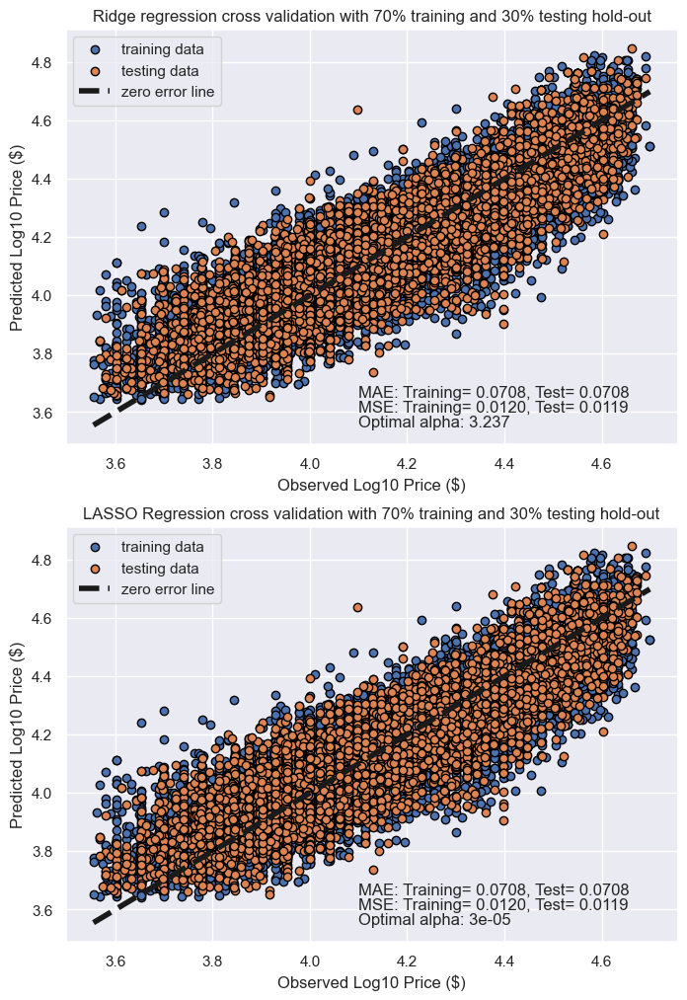
    


Modeling: Cross Validation to check for overfitting


```python
### Cross Validation Ridge 
###
cv_scores = cross_val_score(grid, X, y, cv = 5 )
# %store cv_scores
```


```python
# %store -r cv_scores
print('Cross validation scores (5 folds): {}'.format(cv_scores))
print('The average cross validation score (5 folds): {}'.format(np.mean(cv_scores)))
```

    Cross validation scores (5 folds): [0.59535057 0.70884698 0.67682925 0.61689323 0.55989771]
    The average cross validation score (5 folds): 0.6315635491133533


```python
### Cross Validation LASSO
###
cv_scores2 = cross_val_score( grid2, X, y, cv = 5 )
# %store cv_scores2
```


```python
# %store -r cv_scores2
print('Cross validation scores (5 folds): {}'.format(cv_scores2))
print('The average cross validation score (5 folds): {}'.format(np.mean(cv_scores2)))
```

    Cross validation scores (5 folds): [0.59819455 0.70907338 0.67712465 0.61670888 0.55883511]
    The average cross validation score (5 folds): 0.6319873143125256


Here, we built a number of different regression models with the price as the target. In building our models, we  explored different parameters and cross-validated your models to ensure there is little to no overfitting.

## Evaluation

### 1. Evaluation - Analysis of Resulting Coefficients


```python
### get coef from regression and column transformer and create a dataframe
###
feature_columns = best_model.named_steps["transformer"].get_feature_names_out()

coefs = pd.DataFrame( best_model.named_steps["ridge"].coef_,
                    columns=['coefficients'], 
                    index=feature_columns )

coefs_sorted = coefs.sort_values('coefficients', ascending=False)
coefs_sorted['coefficients'] = coefs_sorted.coefficients.round(5)
# coefs_sorted
```


```python
### get coef from regression and column transformer and create a dataframe
###
feature_columns = best_model2.named_steps["transformer"].get_feature_names_out()

coefs2 = pd.DataFrame( best_model2.named_steps["lasso"].coef_,
                    columns=['coefficients'], 
                    index=feature_columns )

coefs2_sorted = coefs2.sort_values('coefficients', ascending=False)
coefs2_sorted['coefficients'] = coefs2_sorted.coefficients.round(5)
# coefs2_sorted
```


```python
### plot coef from regression and column transformer 
###
coefs_sorted = coefs_sorted.sort_values('coefficients', ascending=True)
coefs2_sorted = coefs2_sorted.sort_values('coefficients', ascending=True)

fig, axes = plt.subplots(1,2,figsize=(12,10))
fig.tight_layout(pad=8)

coefs_sorted.plot.barh(ax=axes[0], legend=False )
axes[0].set_title("Ridge model, optimal regularization")
axes[0].axvline(x=0, color=".5")
axes[0].set_xlabel("Raw coefficient values")

coefs2_sorted.plot.barh(ax=axes[1], legend=False )
axes[1].set_title("LASSO model, optimal regularization")
axes[1].axvline(x=0, color=".5")
ax = axes[1].set_xlabel("Raw coefficient values")
```


    
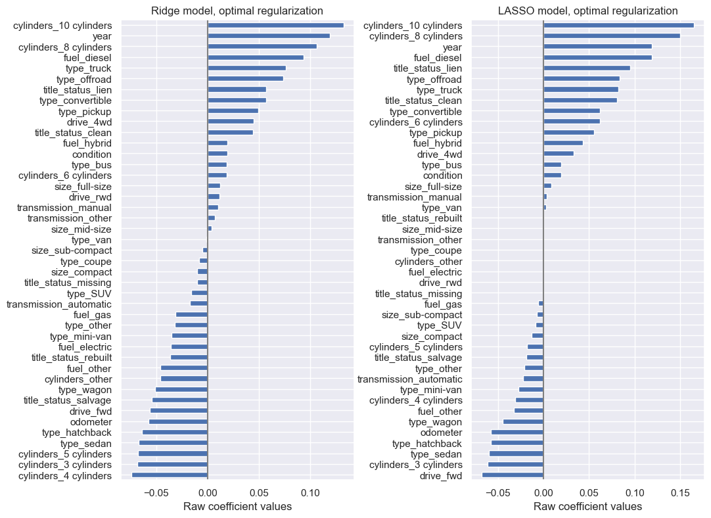
    


The Ridge and LASSO regression models resulted in similar ordering of coefficients and resulting weights. We observe that year has a high positive weight with log10-price and odometer has a strong negative weight as expected in the correlation analysis.  From the categorical coefficients we see that trucks, offroad, pickup vehicles are weighted higher.  Fun or more powerful vehicles like those with 4wd, and convertibles also have higher ranking positive coefficients.   For the negative factors, lower power, economy vehicles rank lower. The fuel hybrid category has positive coefficients while fuel gas category is lower.  It is interesting that electric vehicles still rank lower, and it would be interesting if the higher gas prices in 2021-2022 due to inflation has changed electric vehicle prices. 

### 2. Evaluation - Importance of Coefficients


```python
## for Ridge Regression, compute the importance of coefs using permutation_importance()
##
r = permutation_importance( grid, X_train, y_train, n_repeats=10, random_state=32 )
for i in r.importances_mean.argsort()[::-1]:
    if r.importances_mean[i] - 2 * r.importances_std[i] > 0:
        print(f"{X.columns[i]:<16}"
              f"{r.importances_mean[i]:.3f}"
              f" +/- {r.importances_std[i]:.3f}")
```

    year            0.484 +/- 0.006
    cylinders       0.164 +/- 0.002
    odometer        0.113 +/- 0.001
    type            0.082 +/- 0.002
    drive           0.074 +/- 0.001
    title_status    0.017 +/- 0.001
    fuel            0.014 +/- 0.001
    condition       0.006 +/- 0.000
    size            0.002 +/- 0.000
    transmission    0.001 +/- 0.000


```python
### for LASSO, compute the importance of coefs using permutation_importance()
###
r2 = permutation_importance( grid2, X_train, y_train, n_repeats=10, random_state=32 )
for i in r2.importances_mean.argsort()[::-1]:
    if r2.importances_mean[i] - 2 * r2.importances_std[i] > 0:
        print(f"{X.columns[i]:<16}"
              f"{r2.importances_mean[i]:.3f}"
              f" +/- {r2.importances_std[i]:.3f}")
```

    year            0.485 +/- 0.006
    cylinders       0.165 +/- 0.002
    odometer        0.113 +/- 0.002
    type            0.082 +/- 0.002
    drive           0.074 +/- 0.001
    title_status    0.017 +/- 0.001
    fuel            0.014 +/- 0.001
    condition       0.006 +/- 0.000
    size            0.002 +/- 0.000
    transmission    0.001 +/- 0.000


There are no differences between Ridge and LASSO regression models in coefficient importance's.  The coefficients year, cylinders, and odometer were the most important coefficients.

### 3. Evaluation - TransformedTargetRegressor test

We were curious in using TransformedTargetRegressor and Ridge model (at optimal alpha=0.29) to compare with previous regression results with manually taking the log10(y) transformation. Here we also performed an additional analysis of coefficient importance and variability.  We confirm that TransformedTargetRegressor is equivalent with transforming the y-target using log10(y) and 10**(y).  


```python
# load some additional libraries
#
from sklearn.model_selection import cross_validate
from sklearn.model_selection import RepeatedKFold
from sklearn.compose import TransformedTargetRegressor
import scipy as sp
```


```python
# This time, don't transform the log10(y) here, allow TransformTargetRegressor handle
#
features = ['year', 'condition', 'cylinders', 'fuel', 'odometer', 
            'title_status', 'transmission', 'drive', 'size', 'type']
Xt = df_filtered[features]
yt = df_filtered['price']
Xt_train, Xt_test, yt_train, yt_test = train_test_split(Xt, yt, test_size=0.3, random_state=32)
print(Xt_train.shape)
print(Xt_test.shape)
```

    (18383, 10)
    (7879, 10)


```python
#### create column transformer for pipeline workflow
#
column_trans3 = make_column_transformer(
    (StandardScaler(), ['year', 'odometer']),
    (OneHotEncoder(handle_unknown='ignore'), ['cylinders', 'fuel', 'title_status', 'transmission', 'drive', 'size', 'type'] ),
    (OrdinalEncoder(categories=[['salvage', 'fair', 'good', 'excellent', 'like new', 'new']]), ['condition']),
    remainder='passthrough', verbose_feature_names_out=False )
```


```python
### Setup Ridge regression pipeline workflow 
###
print(f'selected best fit alpha: {grid.best_params_["ridge__alpha"]}')
pipe3 = Pipeline([ ('transformer', column_trans3), 
                 ('ridge', TransformedTargetRegressor(regressor=Ridge(alpha=grid.best_params_['ridge__alpha']), 
                        func=np.log10, inverse_func=sp.special.exp10) )
                ])
```

    selected best fit alpha: 3.2374575428176464


```python
pipe3.fit(Xt_train, yt_train)
```


<style>#sk-container-id-3 {color: black;background-color: white;}#sk-container-id-3 pre{padding: 0;}#sk-container-id-3 div.sk-toggleable {background-color: white;}#sk-container-id-3 label.sk-toggleable__label {cursor: pointer;display: block;width: 100%;margin-bottom: 0;padding: 0.3em;box-sizing: border-box;text-align: center;}#sk-container-id-3 label.sk-toggleable__label-arrow:before {content: "▸";float: left;margin-right: 0.25em;color: #696969;}#sk-container-id-3 label.sk-toggleable__label-arrow:hover:before {color: black;}#sk-container-id-3 div.sk-estimator:hover label.sk-toggleable__label-arrow:before {color: black;}#sk-container-id-3 div.sk-toggleable__content {max-height: 0;max-width: 0;overflow: hidden;text-align: left;background-color: #f0f8ff;}#sk-container-id-3 div.sk-toggleable__content pre {margin: 0.2em;color: black;border-radius: 0.25em;background-color: #f0f8ff;}#sk-container-id-3 input.sk-toggleable__control:checked~div.sk-toggleable__content {max-height: 200px;max-width: 100%;overflow: auto;}#sk-container-id-3 input.sk-toggleable__control:checked~label.sk-toggleable__label-arrow:before {content: "▾";}#sk-container-id-3 div.sk-estimator input.sk-toggleable__control:checked~label.sk-toggleable__label {background-color: #d4ebff;}#sk-container-id-3 div.sk-label input.sk-toggleable__control:checked~label.sk-toggleable__label {background-color: #d4ebff;}#sk-container-id-3 input.sk-hidden--visually {border: 0;clip: rect(1px 1px 1px 1px);clip: rect(1px, 1px, 1px, 1px);height: 1px;margin: -1px;overflow: hidden;padding: 0;position: absolute;width: 1px;}#sk-container-id-3 div.sk-estimator {font-family: monospace;background-color: #f0f8ff;border: 1px dotted black;border-radius: 0.25em;box-sizing: border-box;margin-bottom: 0.5em;}#sk-container-id-3 div.sk-estimator:hover {background-color: #d4ebff;}#sk-container-id-3 div.sk-parallel-item::after {content: "";width: 100%;border-bottom: 1px solid gray;flex-grow: 1;}#sk-container-id-3 div.sk-label:hover label.sk-toggleable__label {background-color: #d4ebff;}#sk-container-id-3 div.sk-serial::before {content: "";position: absolute;border-left: 1px solid gray;box-sizing: border-box;top: 0;bottom: 0;left: 50%;z-index: 0;}#sk-container-id-3 div.sk-serial {display: flex;flex-direction: column;align-items: center;background-color: white;padding-right: 0.2em;padding-left: 0.2em;position: relative;}#sk-container-id-3 div.sk-item {position: relative;z-index: 1;}#sk-container-id-3 div.sk-parallel {display: flex;align-items: stretch;justify-content: center;background-color: white;position: relative;}#sk-container-id-3 div.sk-item::before, #sk-container-id-3 div.sk-parallel-item::before {content: "";position: absolute;border-left: 1px solid gray;box-sizing: border-box;top: 0;bottom: 0;left: 50%;z-index: -1;}#sk-container-id-3 div.sk-parallel-item {display: flex;flex-direction: column;z-index: 1;position: relative;background-color: white;}#sk-container-id-3 div.sk-parallel-item:first-child::after {align-self: flex-end;width: 50%;}#sk-container-id-3 div.sk-parallel-item:last-child::after {align-self: flex-start;width: 50%;}#sk-container-id-3 div.sk-parallel-item:only-child::after {width: 0;}#sk-container-id-3 div.sk-dashed-wrapped {border: 1px dashed gray;margin: 0 0.4em 0.5em 0.4em;box-sizing: border-box;padding-bottom: 0.4em;background-color: white;}#sk-container-id-3 div.sk-label label {font-family: monospace;font-weight: bold;display: inline-block;line-height: 1.2em;}#sk-container-id-3 div.sk-label-container {text-align: center;}#sk-container-id-3 div.sk-container {/* jupyter's `normalize.less` sets `[hidden] { display: none; }` but bootstrap.min.css set `[hidden] { display: none !important; }` so we also need the `!important` here to be able to override the default hidden behavior on the sphinx rendered scikit-learn.org. See: https://github.com/scikit-learn/scikit-learn/issues/21755 */display: inline-block !important;position: relative;}#sk-container-id-3 div.sk-text-repr-fallback {display: none;}</style><div id="sk-container-id-3" class="sk-top-container"><div class="sk-text-repr-fallback"><pre>Pipeline(steps=[(&#x27;transformer&#x27;,
                 ColumnTransformer(remainder=&#x27;passthrough&#x27;,
                                   transformers=[(&#x27;standardscaler&#x27;,
                                                  StandardScaler(),
                                                  [&#x27;year&#x27;, &#x27;odometer&#x27;]),
                                                 (&#x27;onehotencoder&#x27;,
                                                  OneHotEncoder(handle_unknown=&#x27;ignore&#x27;),
                                                  [&#x27;cylinders&#x27;, &#x27;fuel&#x27;,
                                                   &#x27;title_status&#x27;,
                                                   &#x27;transmission&#x27;, &#x27;drive&#x27;,
                                                   &#x27;size&#x27;, &#x27;type&#x27;]),
                                                 (&#x27;ordinalencoder&#x27;,
                                                  OrdinalEncoder(categories=[[&#x27;salvage&#x27;,
                                                                              &#x27;fair&#x27;,
                                                                              &#x27;good&#x27;,
                                                                              &#x27;excellent&#x27;,
                                                                              &#x27;like &#x27;
                                                                              &#x27;new&#x27;,
                                                                              &#x27;new&#x27;]]),
                                                  [&#x27;condition&#x27;])],
                                   verbose_feature_names_out=False)),
                (&#x27;ridge&#x27;,
                 TransformedTargetRegressor(func=&lt;ufunc &#x27;log10&#x27;&gt;,
                                            inverse_func=&lt;ufunc &#x27;exp10&#x27;&gt;,
                                            regressor=Ridge(alpha=3.2374575428176464)))])</pre><b>In a Jupyter environment, please rerun this cell to show the HTML representation or trust the notebook. <br />On GitHub, the HTML representation is unable to render, please try loading this page with nbviewer.org.</b></div><div class="sk-container" hidden><div class="sk-item sk-dashed-wrapped"><div class="sk-label-container"><div class="sk-label sk-toggleable"><input class="sk-toggleable__control sk-hidden--visually" id="sk-estimator-id-25" type="checkbox" ><label for="sk-estimator-id-25" class="sk-toggleable__label sk-toggleable__label-arrow">Pipeline</label><div class="sk-toggleable__content"><pre>Pipeline(steps=[(&#x27;transformer&#x27;,
                 ColumnTransformer(remainder=&#x27;passthrough&#x27;,
                                   transformers=[(&#x27;standardscaler&#x27;,
                                                  StandardScaler(),
                                                  [&#x27;year&#x27;, &#x27;odometer&#x27;]),
                                                 (&#x27;onehotencoder&#x27;,
                                                  OneHotEncoder(handle_unknown=&#x27;ignore&#x27;),
                                                  [&#x27;cylinders&#x27;, &#x27;fuel&#x27;,
                                                   &#x27;title_status&#x27;,
                                                   &#x27;transmission&#x27;, &#x27;drive&#x27;,
                                                   &#x27;size&#x27;, &#x27;type&#x27;]),
                                                 (&#x27;ordinalencoder&#x27;,
                                                  OrdinalEncoder(categories=[[&#x27;salvage&#x27;,
                                                                              &#x27;fair&#x27;,
                                                                              &#x27;good&#x27;,
                                                                              &#x27;excellent&#x27;,
                                                                              &#x27;like &#x27;
                                                                              &#x27;new&#x27;,
                                                                              &#x27;new&#x27;]]),
                                                  [&#x27;condition&#x27;])],
                                   verbose_feature_names_out=False)),
                (&#x27;ridge&#x27;,
                 TransformedTargetRegressor(func=&lt;ufunc &#x27;log10&#x27;&gt;,
                                            inverse_func=&lt;ufunc &#x27;exp10&#x27;&gt;,
                                            regressor=Ridge(alpha=3.2374575428176464)))])</pre></div></div></div><div class="sk-serial"><div class="sk-item sk-dashed-wrapped"><div class="sk-label-container"><div class="sk-label sk-toggleable"><input class="sk-toggleable__control sk-hidden--visually" id="sk-estimator-id-26" type="checkbox" ><label for="sk-estimator-id-26" class="sk-toggleable__label sk-toggleable__label-arrow">transformer: ColumnTransformer</label><div class="sk-toggleable__content"><pre>ColumnTransformer(remainder=&#x27;passthrough&#x27;,
                  transformers=[(&#x27;standardscaler&#x27;, StandardScaler(),
                                 [&#x27;year&#x27;, &#x27;odometer&#x27;]),
                                (&#x27;onehotencoder&#x27;,
                                 OneHotEncoder(handle_unknown=&#x27;ignore&#x27;),
                                 [&#x27;cylinders&#x27;, &#x27;fuel&#x27;, &#x27;title_status&#x27;,
                                  &#x27;transmission&#x27;, &#x27;drive&#x27;, &#x27;size&#x27;, &#x27;type&#x27;]),
                                (&#x27;ordinalencoder&#x27;,
                                 OrdinalEncoder(categories=[[&#x27;salvage&#x27;, &#x27;fair&#x27;,
                                                             &#x27;good&#x27;,
                                                             &#x27;excellent&#x27;,
                                                             &#x27;like new&#x27;,
                                                             &#x27;new&#x27;]]),
                                 [&#x27;condition&#x27;])],
                  verbose_feature_names_out=False)</pre></div></div></div><div class="sk-parallel"><div class="sk-parallel-item"><div class="sk-item"><div class="sk-label-container"><div class="sk-label sk-toggleable"><input class="sk-toggleable__control sk-hidden--visually" id="sk-estimator-id-27" type="checkbox" ><label for="sk-estimator-id-27" class="sk-toggleable__label sk-toggleable__label-arrow">standardscaler</label><div class="sk-toggleable__content"><pre>[&#x27;year&#x27;, &#x27;odometer&#x27;]</pre></div></div></div><div class="sk-serial"><div class="sk-item"><div class="sk-estimator sk-toggleable"><input class="sk-toggleable__control sk-hidden--visually" id="sk-estimator-id-28" type="checkbox" ><label for="sk-estimator-id-28" class="sk-toggleable__label sk-toggleable__label-arrow">StandardScaler</label><div class="sk-toggleable__content"><pre>StandardScaler()</pre></div></div></div></div></div></div><div class="sk-parallel-item"><div class="sk-item"><div class="sk-label-container"><div class="sk-label sk-toggleable"><input class="sk-toggleable__control sk-hidden--visually" id="sk-estimator-id-29" type="checkbox" ><label for="sk-estimator-id-29" class="sk-toggleable__label sk-toggleable__label-arrow">onehotencoder</label><div class="sk-toggleable__content"><pre>[&#x27;cylinders&#x27;, &#x27;fuel&#x27;, &#x27;title_status&#x27;, &#x27;transmission&#x27;, &#x27;drive&#x27;, &#x27;size&#x27;, &#x27;type&#x27;]</pre></div></div></div><div class="sk-serial"><div class="sk-item"><div class="sk-estimator sk-toggleable"><input class="sk-toggleable__control sk-hidden--visually" id="sk-estimator-id-30" type="checkbox" ><label for="sk-estimator-id-30" class="sk-toggleable__label sk-toggleable__label-arrow">OneHotEncoder</label><div class="sk-toggleable__content"><pre>OneHotEncoder(handle_unknown=&#x27;ignore&#x27;)</pre></div></div></div></div></div></div><div class="sk-parallel-item"><div class="sk-item"><div class="sk-label-container"><div class="sk-label sk-toggleable"><input class="sk-toggleable__control sk-hidden--visually" id="sk-estimator-id-31" type="checkbox" ><label for="sk-estimator-id-31" class="sk-toggleable__label sk-toggleable__label-arrow">ordinalencoder</label><div class="sk-toggleable__content"><pre>[&#x27;condition&#x27;]</pre></div></div></div><div class="sk-serial"><div class="sk-item"><div class="sk-estimator sk-toggleable"><input class="sk-toggleable__control sk-hidden--visually" id="sk-estimator-id-32" type="checkbox" ><label for="sk-estimator-id-32" class="sk-toggleable__label sk-toggleable__label-arrow">OrdinalEncoder</label><div class="sk-toggleable__content"><pre>OrdinalEncoder(categories=[[&#x27;salvage&#x27;, &#x27;fair&#x27;, &#x27;good&#x27;, &#x27;excellent&#x27;, &#x27;like new&#x27;,
                            &#x27;new&#x27;]])</pre></div></div></div></div></div></div><div class="sk-parallel-item"><div class="sk-item"><div class="sk-label-container"><div class="sk-label sk-toggleable"><input class="sk-toggleable__control sk-hidden--visually" id="sk-estimator-id-33" type="checkbox" ><label for="sk-estimator-id-33" class="sk-toggleable__label sk-toggleable__label-arrow">remainder</label><div class="sk-toggleable__content"><pre>[]</pre></div></div></div><div class="sk-serial"><div class="sk-item"><div class="sk-estimator sk-toggleable"><input class="sk-toggleable__control sk-hidden--visually" id="sk-estimator-id-34" type="checkbox" ><label for="sk-estimator-id-34" class="sk-toggleable__label sk-toggleable__label-arrow">passthrough</label><div class="sk-toggleable__content"><pre>passthrough</pre></div></div></div></div></div></div></div></div><div class="sk-item sk-dashed-wrapped"><div class="sk-label-container"><div class="sk-label sk-toggleable"><input class="sk-toggleable__control sk-hidden--visually" id="sk-estimator-id-35" type="checkbox" ><label for="sk-estimator-id-35" class="sk-toggleable__label sk-toggleable__label-arrow">ridge: TransformedTargetRegressor</label><div class="sk-toggleable__content"><pre>TransformedTargetRegressor(func=&lt;ufunc &#x27;log10&#x27;&gt;, inverse_func=&lt;ufunc &#x27;exp10&#x27;&gt;,
                           regressor=Ridge(alpha=3.2374575428176464))</pre></div></div></div><div class="sk-parallel"><div class="sk-parallel-item"><div class="sk-item"><div class="sk-label-container"><div class="sk-label sk-toggleable"><input class="sk-toggleable__control sk-hidden--visually" id="sk-estimator-id-36" type="checkbox" ><label for="sk-estimator-id-36" class="sk-toggleable__label sk-toggleable__label-arrow">regressor: Ridge</label><div class="sk-toggleable__content"><pre>Ridge(alpha=3.2374575428176464)</pre></div></div></div><div class="sk-serial"><div class="sk-item"><div class="sk-estimator sk-toggleable"><input class="sk-toggleable__control sk-hidden--visually" id="sk-estimator-id-37" type="checkbox" ><label for="sk-estimator-id-37" class="sk-toggleable__label sk-toggleable__label-arrow">Ridge</label><div class="sk-toggleable__content"><pre>Ridge(alpha=3.2374575428176464)</pre></div></div></div></div></div></div></div></div></div></div></div></div>


```python
train_mse = mean_squared_error(yt_train, pipe3.predict(Xt_train))
string_score = f"MSE on training set: {train_mse:.2f}\n"
test_mse = mean_squared_error(yt_test, pipe3.predict(Xt_test))
string_score += f"MSE on testing set: {test_mse:.2f}\n"

train_mae = median_absolute_error( yt_train, pipe3.predict(X_train) )
string_score +=(f'MAE on training set: {train_mae: .4f}\n')
test_mae = median_absolute_error( yt_test, pipe3.predict(Xt_test) )
string_score +=(f'MAE on testing set: {test_mae: .4f}\n')
```


```python
fig, ax = plt.subplots(figsize=(8, 6))

# ax.scatter(np.log10(yt_test), np.log10(pipe3.predict(Xt_test)))
# ax.text(3.6, 4.6, string_score)
# ax.plot( [3.5, 4.8], [3.5, 4.8], ls="--", c="red" )

ax.scatter(yt_test, pipe3.predict(Xt_test), label='testing data')
ax.text(4000, 50000, string_score)
ax.plot( [3000, 50000], [3000, 50000], ls="--", c="red", label="zero error line" )
ax.set_title(f'Ridge model, regularization alpha = {grid.best_params_["ridge__alpha"].round(3)}, with 70% training and 30% testing hold-out')
ax.set_xlabel("Observed Log10 Price ($)")
ax.set_ylabel("Predicted Log10 Price ($)")
ax.legend()
plt.show()
```


    

    


 We confirm that TransformedTargetRegressor is equivalent with transforming the y-target using log10(y) and 10**(y).

### 4. Evaluation: Coefficient Importance and Variability Analysis


```python
# create dataframe of coefs and plot
#
feature_names = pipe3[:-1].get_feature_names_out()

coefs = pd.DataFrame(
    pipe3[-1].regressor_.coef_,
    columns=["Coefficients"],
    index=feature_names,
)

coefs_sorted = coefs.sort_values('Coefficients', ascending=True)

coefs_sorted.plot.barh(figsize=(6, 9))
plt.title("Ridge model, small regularization")
plt.axvline(x=0, color=".5")
plt.xlabel("Raw coefficient values")
plt.subplots_adjust(left=0.3)
plt.show()
```


    
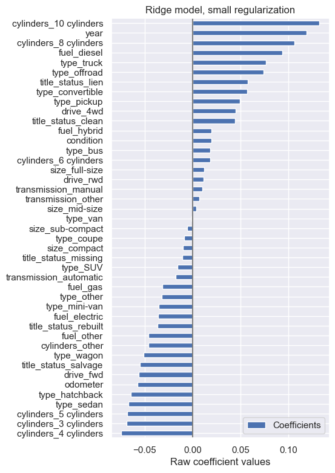
    


This plot is exactly the same as above with the Ridge regression coefs


```python
# create dataframe of coefs standard deviations and plot
#
xx = pipe3[:-1].transform(Xt_train)
X_train_preprocessed = pd.DataFrame( xx.toarray(), columns=feature_names )
X_train_preprocessed_std  = X_train_preprocessed.std(axis=0).sort_values()
#
X_train_preprocessed_std.plot.barh(figsize=(7, 9))
plt.title("Feature ranges")
plt.xlabel("Std. dev. of feature values")
plt.subplots_adjust(left=0.3)
```


    
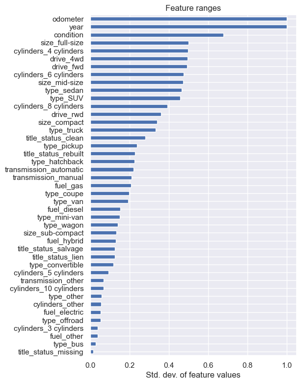
    


```python
# Coefficient importance = Scale coefs by standard deviations and plot 
#
cx = pipe3[-1].regressor_.coef_
stdx = X_train_preprocessed_std
data = abs(cx) * stdx
coefs = pd.DataFrame( data, columns=["Coefficient importance"], index=feature_names )
coefs_sorted = coefs.sort_values("Coefficient importance")

coefs_sorted.plot(kind="barh", figsize=(7, 9), legend=False)
plt.xlabel("Coefficient values corrected by the feature's std. dev.")
plt.title("abs(coefs) * coefs.std()")
plt.axvline(x=0, color=".5")
plt.subplots_adjust(left=0.3)
```


    

    


```python
### do k-fold cross validation to examine coefs variability
###
cv = RepeatedKFold(n_splits=5, n_repeats=5, random_state=32)

cv_model = cross_validate(
    pipe3,
    Xt,
    yt,
    cv=cv,
    return_estimator=True,
    n_jobs=2,
)
```


```python
coefs_variable = pd.DataFrame(
    [pipe3[-1].regressor_.coef_ for pipe3 in cv_model["estimator"]], columns=feature_names
)
#coefs_variable.head(20)
```


```python
plt.figure(figsize=(9, 7))
order_list = coefs_sorted.index.tolist()

sns.stripplot(data=coefs_variable, orient="h", color="k", alpha=0.5, order=order_list )
sns.boxplot(data=coefs_variable, orient="h", color="cyan", saturation=0.5, whis=10, order=order_list )
plt.axvline(x=0, color=".5")
plt.title("Coefficient variability")
plt.subplots_adjust(left=0.3)
```


    
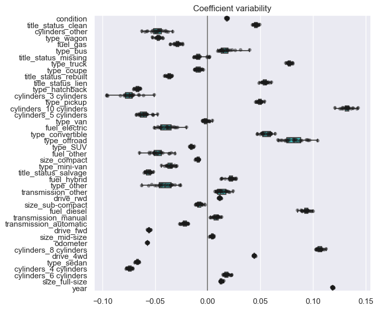
    


We identify variability in coefficients that may not be well resolved.  These include categories (fuel_other, type_other, cylinder_other) that involve other selections that may not be well represented in the dataset. Also, less represented features like 3-cylinders, offroad, bus, fuel_electric may not be well represented.

Implications to used car business - The model's coefficients for well represented features seem stable.  The model indicates so logical expectations that vehicles that are specialized (e.g., offroad, truck) or have more power rank higher with positive coefficients leading to higher value while economy vehicles with lower power rank lower leading to decrease in vehicles resale value.

### 5. Evaluation: Residual Analysis 

We compare residuals from Ridge model predictions with features included in the model and some that were left out to evaluate model performance and directions for model improvement  


```python
# recreate dataframe used in regression for prediction
#
features = ['year', 'condition', 'cylinders', 'fuel', 'odometer', 
            'title_status', 'transmission', 'drive', 'size', 'type']
Xp = df_filtered[features]
#yp = df_filtered['price']
yp = np.log10( df_filtered['price'] )
# Xp.info()
# yp.describe()
```


```python
# add additional columns to dataframe
#
Xp['predict'] = (10**best_model.predict(Xp)).round(2)
Xp['price'] = 10**yp
Xp['residual'] = Xp['price'] - Xp['predict']
#Xp.info()
#Xp
```


```python
## check for residual trends by year
#
sns.set(rc={'figure.figsize':(12,6)})
sns.boxplot(data=Xp, x="year", y="residual" ).set(title='Distribution of price residuals by year')
plt.show()
```


    
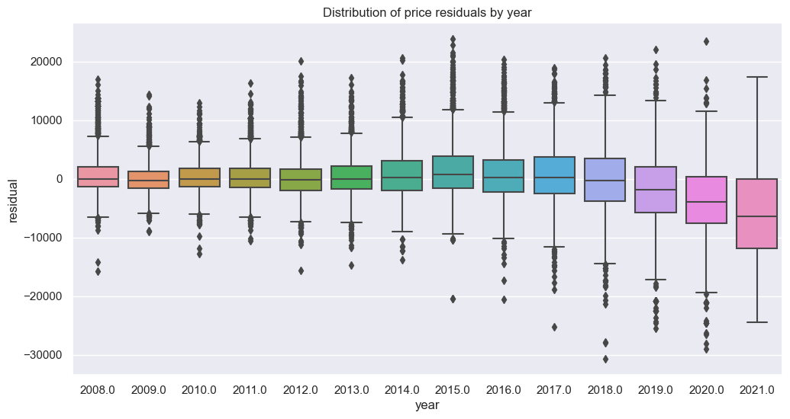
    


Note that we identify that there is increasing misfit with year for used cars that are only 1 to 2 years old.  This indicates that we may need to keep all data of cars by age of sale instead of time in years. 


```python
## check for residual trends by vehicle type
#
sns.set(rc={'figure.figsize':(12,6)})
sns.boxplot(data=Xp, x="type", y="residual" )
plt.show()
```


    
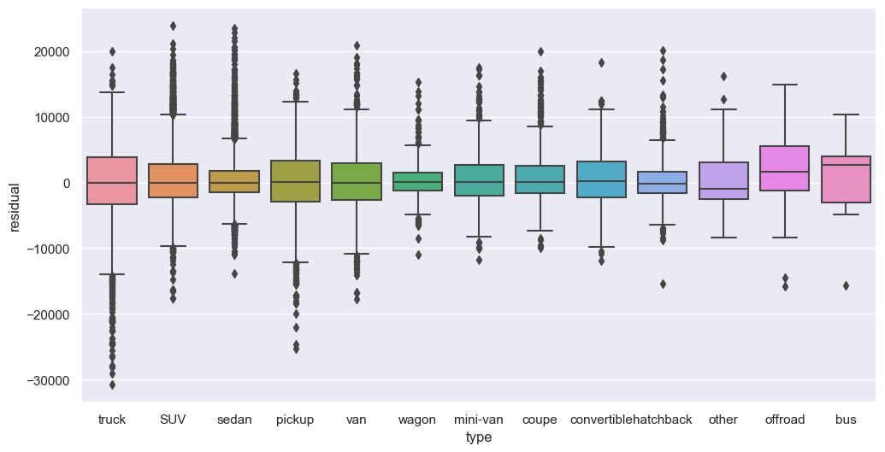
    


merge the original dataframe with the residuals and plot by state


```python
#Xp.info()
Xdrop = Xp.drop(columns=['price', 'year', 'condition', 'cylinders', 'fuel', 'odometer', 'title_status', 'transmission', 'drive', 'size', 'type'])
df_merge = pd.merge(df_filtered, Xdrop, left_index=True, right_index=True)
#df_merge.head()
#df_merge.info()
```


```python
### visually there is little relationship between price residual and paint_color feature
###
sns.set(rc={'figure.figsize':(15,6)})
sns.boxplot(data=df_merge, x="paint_color", y="residual" )
plt.show()
```


    
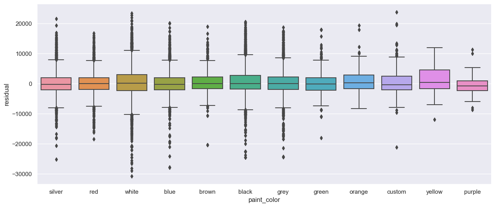
    


```python
# resid_by_color = df_merge.groupby(by='paint_color')[['paint_color', 'residual']].median().sort_values(by='residual')
# resid_by_color.plot.bar()
```


```python
## group all the residuals by state and compute the mean residual. Sort states by mean residuals. 
##
resid_by_state = df_merge.groupby(by='state')[['state', 'residual']].mean().sort_values(by='residual', ascending=False)
```


```python
fig, ax = plt.subplots(figsize=(12,6))
resid_by_state.plot.bar(ax=ax, legend=False)
ax.set_xlabel('State')
ax.set_ylabel('Mean Residual Price ($)')
ax.set_title('Used Car Price Residuals by State')
fig.show()
```


    
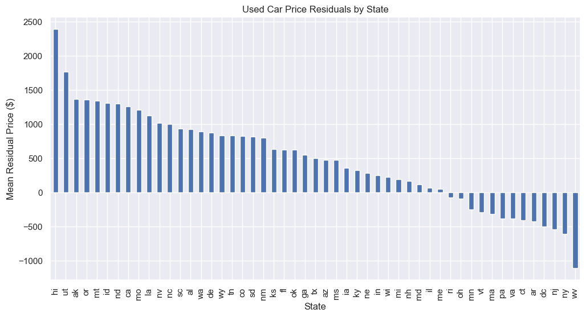
    


As expected, states HI, AK, and CA have more expensive used cars by \\$ 2000 to \\$ 1000.  The cost of living in these states are higher.  UT, OR, MT, ND, MO and LA are interesting states where vehicle prices are higher.  Perhaps this is due to the fact that trucks are common in the western US, which are more expensive. West Virgina is the state where used cars are cheaper by \\$1000

## Deployment
We perform a direct application of regression model for two example cars. 

Comparison of the model to kbb.com with two example cars:

1. 2015 Toyota Tacoma Pickup Truct with 96k mi
 
https://www.kbb.com/toyota/tacoma-double-cab/2015/prerunner-pickup-4d-5-ft/?category=pickup&condition=verygood&intent=buy-used&mileage=96322&options=10879479%7Ctrue%7C6059907%7Ctrue%7C6060302%7Cfalse%7C6059999%7Ctrue&pricetype=private-party&vehicleid=402400
 
2. 2013 Honda fit subcompact hatchback with 113k mi

https://www.kbb.com/honda/fit/2013/hatchback-4d/?category=hatchback&condition=good&intent=buy-used&mileage=113035&options=6520167%7Ctrue&pricetype=private-party&vehicleid=378827
 


```python
# A 2015 Toyota Tacoma Pickup Truct with 96k mi
df1 = pd.DataFrame( data={'year': 2015, 
                         'condition': 'excellent', 
                         'cylinders': '6 cylinders',
                         'fuel' : 'gas', 
                         'odometer': 96322.0,
                        'title_status' : 'clean', 
                        'transmission' :'automatic',
                        'drive' : 'rwd',
                        'size' : 'full-size',
                        'type' : 'truck', 
                         'kbb_low': 19672,
                         'kbb_hi': 22485, 
                          'predict_price': '0', 'regression': 'ridge' }, index=[1] )

# A 2013 Honda fit subcompact hatchback with 113k mi
df2 = pd.DataFrame( data={'year': 2013, 
                         'condition': 'fair', 
                         'cylinders': '4 cylinders',
                         'fuel' : 'gas', 
                         'odometer': 113035.0,
                        'title_status' : 'clean', 
                        'transmission' :'automatic',
                        'drive' : 'fwd',
                        'size' : 'sub-compact',
                        'type' : 'hatchback',
                        'kbb_low' : 6249,
                         'kbb_hi' : 7748,
                         'predict_price': '0', 'regression': 'ridge' }, index=[2]  )

df = pd.concat([df1,df2,df1,df2], ignore_index=True)
df['predict_price'] = df.predict_price.astype(float)
# df
```


```python
### Comparisons with KBB: Ridge regression model
###
df.iloc[0,13] = "ridge"
df.iloc[1,13] = "ridge"
df.iloc[0,12] = (10**best_model.predict(df.iloc[[0]])).round(0)
df.iloc[1,12] = (10**best_model.predict(df.iloc[[1]])).round(0)

### Comparisons with KBB: LASSO regression model
###
df.iloc[2,13] = "lasso"
df.iloc[3,13] = "lasso"
df.iloc[2,12] = (10**best_model2.predict(df.iloc[[2]])).round(0)
df.iloc[3,12] = (10**best_model2.predict(df.iloc[[3]])).round(0)
df
```


<div>
<style scoped>
    .dataframe tbody tr th:only-of-type {
        vertical-align: middle;
    }

    .dataframe tbody tr th {
        vertical-align: top;
    }

    .dataframe thead th {
        text-align: right;
    }
</style>
<table border="1" class="dataframe">
  <thead>
    <tr style="text-align: right;">
      <th></th>
      <th>year</th>
      <th>condition</th>
      <th>cylinders</th>
      <th>fuel</th>
      <th>odometer</th>
      <th>title_status</th>
      <th>transmission</th>
      <th>drive</th>
      <th>size</th>
      <th>type</th>
      <th>kbb_low</th>
      <th>kbb_hi</th>
      <th>predict_price</th>
      <th>regression</th>
    </tr>
  </thead>
  <tbody>
    <tr>
      <th>0</th>
      <td>2015</td>
      <td>excellent</td>
      <td>6 cylinders</td>
      <td>gas</td>
      <td>96322.0</td>
      <td>clean</td>
      <td>automatic</td>
      <td>rwd</td>
      <td>full-size</td>
      <td>truck</td>
      <td>19672</td>
      <td>22485</td>
      <td>21588.0</td>
      <td>ridge</td>
    </tr>
    <tr>
      <th>1</th>
      <td>2013</td>
      <td>fair</td>
      <td>4 cylinders</td>
      <td>gas</td>
      <td>113035.0</td>
      <td>clean</td>
      <td>automatic</td>
      <td>fwd</td>
      <td>sub-compact</td>
      <td>hatchback</td>
      <td>6249</td>
      <td>7748</td>
      <td>7515.0</td>
      <td>ridge</td>
    </tr>
    <tr>
      <th>2</th>
      <td>2015</td>
      <td>excellent</td>
      <td>6 cylinders</td>
      <td>gas</td>
      <td>96322.0</td>
      <td>clean</td>
      <td>automatic</td>
      <td>rwd</td>
      <td>full-size</td>
      <td>truck</td>
      <td>19672</td>
      <td>22485</td>
      <td>21572.0</td>
      <td>lasso</td>
    </tr>
    <tr>
      <th>3</th>
      <td>2013</td>
      <td>fair</td>
      <td>4 cylinders</td>
      <td>gas</td>
      <td>113035.0</td>
      <td>clean</td>
      <td>automatic</td>
      <td>fwd</td>
      <td>sub-compact</td>
      <td>hatchback</td>
      <td>6249</td>
      <td>7748</td>
      <td>7552.0</td>
      <td>lasso</td>
    </tr>
  </tbody>
</table>
</div>


The above application of two example vehicles show that the model works well in comparison with Kelly Blue Book (kbb.com) low and high value range. 

In conclusion, 

### Preliminary findings:


1. Value of vehicles decrease with age and higher odometer readings. One would also expect inverse relation between years and odometer. 10 years is the age where car values flatten out < 10k. This is also where the odometer also flattens out around ~110k miles.  


2. The model indicates so logical expectations that vehicles that are specialized (e.g., offroad, truck) or have more power rank higher with positive coefficients leading to higher value while economy vehicles with lower power rank lower leading to decrease in vehicles resale value.


3. Year, cylinders, and odometer were the most important.


4. We identify some variability in coefficients that may not be well resolved. These include categories (fuel_other, type_other, cylinder_other) that involve other selections that may not be well represented in the dataset. Also, less represented features like 3-cylinders, offroad, bus, fuel_electric may not be well represented.


5. We demonstrate that for two example vehicles (2013 Honda Fit and 2015 Toyota Tacoma) that the model predicts the value of the vehicle within the range of the Kelly Blue Book value (kbb.com). This demonstrates the usefulness of the model.


### What does this mean for implications in fine tuning inventory?

1. Age and year play an important role. Values of cars flatten out after 10 years or 110k miles. Dealers may want to adjust inventory to maximize profits accordingly.  


2. Consumers want fun (offroad, trucks, 4wd) and powerful (10,8,6 cylinder) vehicles. Vehicles with these features are valued more.  Dealers may want to stock these kinds of cars as opposed to vehicles that have negative coefficients. These tended to be more economy or budget cars with lower power.  

### Next steps, future directions, and recommendations:

1. Examine the residuals group by the following to check for trends:

    A. region
    
    B. model and make
    
    C. color

    These features were not used in the regression. If trends exist, then future work could include adding these.
    
    
2. Revisit dataset in a few years to see if there is increase in value for fuel efficient vehicles due to gas inflation.

3. Understand why the model has more misfit for newer used cars (1 to 2 years old). Improving prediction can help pricing newer used cars which will have more value. 
